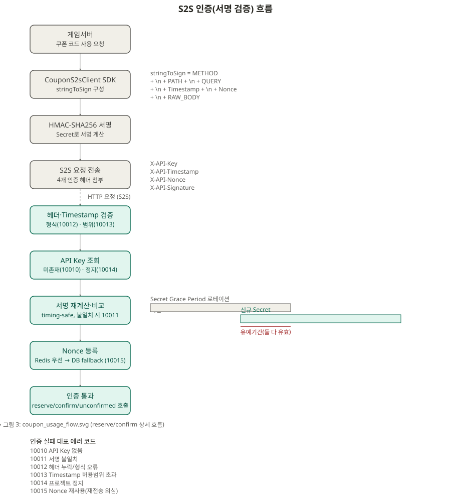
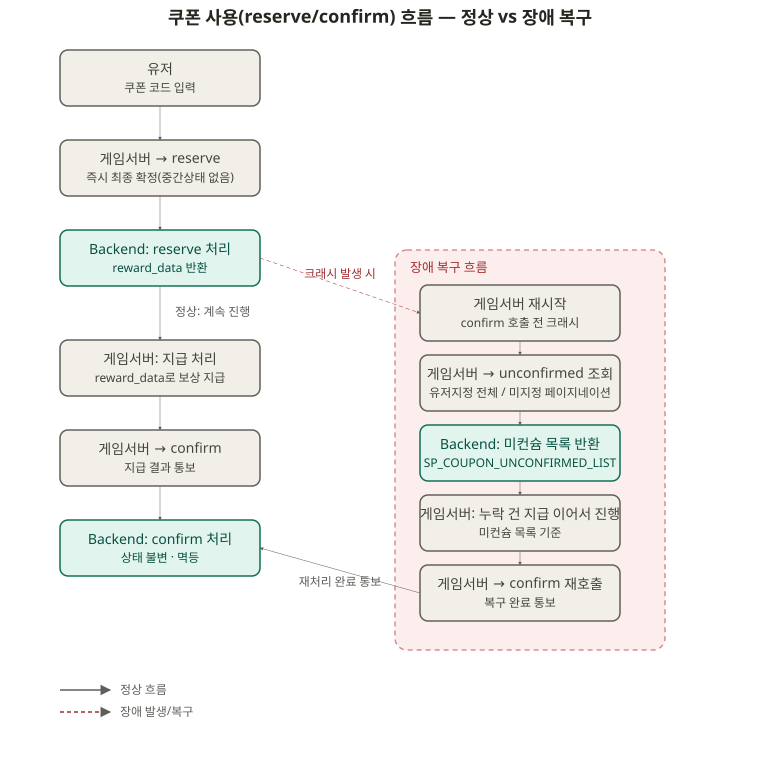
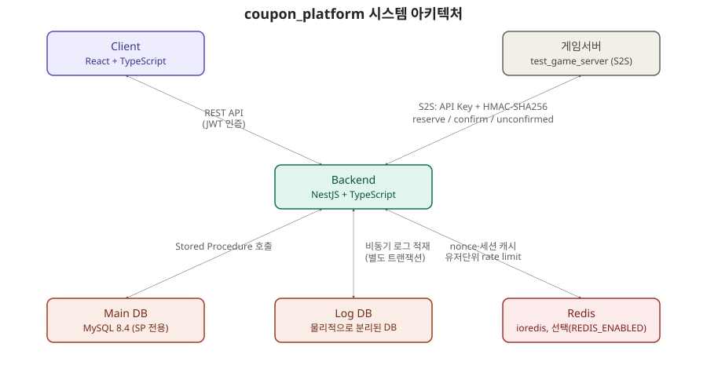

# coupon_platform

> 여러 게임이 하나의 플랫폼을 공유해 쓰는 멀티테넌트 쿠폰 발급/사용 서버

---

## 요약

멀티테넌트 쿠폰 발급/사용 플랫폼 — 여러 게임사가 하나의 서버를 공유해 쿠폰을 발급·검증한다.

- **핵심 기술**: Node.js 22 + NestJS + TypeScript · MySQL 8.4(Stored Procedure 전용) · Redis(ioredis) · React 18 + Vite + Ant Design
- **정량 성과**: 테이블 13개, API 엔드포인트 42개, E2E 테스트 8개 도메인/141개 100% PASS
- **기술적 강조점**: S2S HMAC-SHA256 서명 인증(리플레이 방지) · reserve/confirm 즉시확정 멱등 모델 · DB 락 기반 동시성 제어(오버셀 방지)

---

## 목차

- [요약](#요약)
- [왜 만들었나](#왜-만들었나)
- [핵심 아이디어](#핵심-아이디어)
- [기술적 도전과 해결](#기술적-도전과-해결)
- [멀티테넌트 운영 구조](#멀티테넌트-운영-구조)
- [기술 스택](#기술-스택)
- [주요 기능](#주요-기능)
- [문서 목록](#문서-목록)
- [프로젝트 구조](#프로젝트-구조)
- [AI 활용](#ai-활용)
- [현재 상태](#현재-상태)
- [한계 및 개선 과제](#한계-및-개선-과제)
- [라이선스](#라이선스)

---

## 왜 만들었나

게임마다 이벤트 쿠폰(신규가입 보상, 프로모션 코드 등)을 발급하고 검증하는 기능이 필요하다. 문제는 이 기능을 게임마다 각자 구현하면 같은 실수가 반복된다는 점이다.

- 같은 쿠폰 코드가 동시에 두 번 소모되는 레이스 컨디션
- 한정 수량 쿠폰이 목표 수량을 넘겨 발급/소모되는 오버셀
- 게임서버↔쿠폰서버 간 통신을 가로채 재전송하는 리플레이 공격
- 여러 게임(테넌트)이 뒤섞여 서로의 쿠폰 코드/사용 이력을 침범하는 데이터 격리 실패

**coupon_platform은 이 문제를 여러 게임이 공유하는 하나의 플랫폼으로 풀기 위해 설계했다.** 게임서버는 쿠폰 발급/사용 시점에 이 서버를 호출하기만 하면 되고, 동시성·보안·테넌트 격리는 플랫폼이 구조적으로 보장한다.

---

## 핵심 아이디어

쿠폰 사용은 게임서버가 "이 코드 쓸게" → "지급 결과 알려줄게" 두 단계로 호출하는 게 자연스럽다. 하지만 이 두 호출 사이에 게임서버가 죽거나 응답을 놓치면 어떻게 될까?

coupon_platform은 인앱결제의 consume/acknowledge 패턴을 참고해 **reserve 시점에 소모를 즉시 확정**하고, 뒤이은 confirm은 지급 결과를 통보받는 용도로만 쓰도록 설계했다. 분산 트랜잭션 없이도 재시도가 항상 안전하다 — reserve를 두 번 호출해도(멱등), confirm을 영원히 안 불러도(코드는 이미 소모 완료 처리) 데이터가 어긋나지 않는다.

이 모델을 실제로 안전하게 만드는 건 결국 동시성 처리다:

- 코드 중복 소모/캠페인 오버셀 → 조건부 UPDATE + 갭락
- 관리 콘솔의 동시 수정 충돌 → `edit_count` 낙관적 동시성 제어
- 게임서버 인증 재전송 → API Key + HMAC-SHA256 서명 + Timestamp/Nonce, Secret은 유예기간을 둔 로테이션

---

## 기술적 도전과 해결

### 1. S2S 인증 서명 검증



- **문제**: 게임서버 ↔ 쿠폰서버 API는 쿠폰 소모(재화 지급)에 직결되는데, 단순 API Key/Secret 정적 헤더 대조 방식은 요청을 가로채 그대로 재전송하는 리플레이 공격에 취약하다.
- **왜 어려웠는가**:
  - 검증 순서를 잘못 두면 위조/스팸 요청까지 값비싼 단계(Project 조회, Secret 복호화)를 다 태우게 되고, 반대로 서명 확인 전에 Nonce부터 등록하면 서명이 틀린 위조 요청도 재전송 방지 테이블에 흔적을 남겨 정상 요청이 나중에 오탐으로 막힐 수 있다.
  - API Secret을 재발급(로테이션)해야 하는데, 재발급 순간 구 Secret으로 서명 중이던 진행 중 요청이 즉시 끊기면 안 된다.
- **어떻게 해결했는가**:
  - 검증 단계를 비용 순으로 고정: ① 헤더 형식(10012, DB 조회 없음) → ② Timestamp 허용범위(10013, DB 조회 없음) → ③ API Key로 project 조회 + 정지 확인(10010/10014) → ④ 서명 재계산 후 timing-safe 비교(10011) → ⑤ Nonce 등록(10015)은 서명이 확인된 요청에만 수행.
  - Secret Grace Period 로테이션 — 재발급 시 이전 Secret을 유예기간 동안 `api_secret_prev`로 함께 보관해, 서명 검증 시 현재/이전 Secret을 모두 시도(둘 중 하나만 맞아도 통과).
  - Nonce 저장은 Redis `SET NX EX`를 1차 경로로 쓰고, Redis 장애 시 DB UNIQUE 제약 경로로 fail-open 폴백 — 재전송 방지 자체가 가용성 병목이 되지 않게 함.
- **결과**: 리플레이 공격을 차단하면서도 위조 요청이 값비싼 검증 단계까지 도달하지 않고, Secret 재발급 중에도 진행 중이던 정상 요청이 끊기지 않는다.

### 2. reserve/confirm/unconfirmed 멱등성 설계



- **문제**: 게임서버가 reserve 호출 후 응답을 받기 전에 타임아웃/크래시가 나면 "재시도해도 안전한가?"에 답해야 하는데, 무작정 재시도를 멱등 처리하면 유저가 정당하게 여러 번 쓸 수 있는 캠페인에서 진짜 반복 사용과 재시도를 구분하지 못하게 된다.
- **왜 어려웠는가**:
  - 코드 1건이 유저당 딱 1회만 소모되는 캠페인(`use_limit_per_user=1`)과, 코드 1건을 여러 유저가 각자 여러 번 쓸 수 있는 FIXED 다중한도 캠페인(`use_limit_per_user>1`)은 "같은 코드+같은 유저의 두 번째 요청"이 의미하는 바가 정반대다 — 후자는 서버가 재시도인지 정당한 반복 사용인지 구분할 방법이 없다.
  - 재전송 방지(Nonce)와 비즈니스 멱등성은 서로 다른 층위인데 헷갈리기 쉽다 — "같은 요청을 그대로 다시 보내면 안전하다"는 멱등성 개념과 "같은 Nonce는 무조건 거부(10015)"가 얼핏 충돌하는 것처럼 보인다.
- **어떻게 해결했는가**:
  - `use_limit_per_user=1`일 때만 (코드, 유저) 기존 사용 이력을 확인해 있으면 새로 소모하지 않고 최초 성공 응답을 그대로 재반환(멱등). `use_limit_per_user>1`(FIXED)에서는 이 처리를 적용하지 않고 매 호출을 새 소모 시도로 처리해, 정당한 반복 사용을 막지 않는다.
  - 대신 unconfirmed(미컨슘) 조회 API를 제공해, 다중한도 캠페인에서는 재시도 전에 실제 소모 여부를 먼저 확인하도록 안내한다.
  - Nonce는 HTTP 요청 자체의 재전송 방지(전송 계층), 멱등 체크는 비즈니스 로직 수준(코드+유저 조합)으로 계층을 분리 — 그래서 재시도할 때도 Timestamp/Nonce/서명은 매번 새로 생성해야 한다. 같은 Nonce로 보내면 비즈니스 로직에 도달하기도 전에 인증 단계에서 거부된다.
- **결과**: `use_limit_per_user=1` 캠페인은 재시도가 항상 안전하고, 다중한도 캠페인은 멱등을 억지로 흉내내지 않는 대신 미컨슘 조회로 안전한 재처리 경로를 제공한다 — 성격이 다른 두 캠페인에 하나의 멱등 규칙을 강제하지 않는다.

### 3. Redis 도입과 레이트리밋 관측성

- **문제**: JWT 세션 검증(매 인증 요청마다 DB 조회)과 nonce 재전송 방지가 전부 DB 왕복에 의존해 규모가 커질수록 부하가 늘고, reserve/confirm에서 실제로 429가 발생한 시도를 추적할 방법이 없었다.
- **왜 어려웠는가**:
  - 세션 검증에 캐시를 들이면 "DB가 방금 바뀐 상태(로그아웃/비밀번호변경/계정정지)를 캐시가 아직 모르는" 무효화 문제가 생긴다.
  - 레이트리밋 리젝트는 `S2sAuthGuard` 인증 **이전**(미들웨어 단계)에 발생해, 정작 `project_id`/`company_id`를 아직 모르는 시점에 로그를 남겨야 한다.
- **어떻게 해결했는가**:
  - JWT 세션 검증을 유저 단위 generation 카운터 기반 읽기 캐시로 구현(DB가 항상 source of truth) — 로그아웃/비밀번호변경/계정정지 시 카운터를 올려 그 유저의 캐시된 세션 전체를 일괄 무효화.
  - reserve/confirm에 프로젝트 단위(in-memory 토큰 버킷)와 유저 단위(Redis 슬라이딩 윈도우 카운터) 2단계 rate limit을 분리 적용 — 특정 유저의 과도한 호출이 같은 프로젝트의 다른 유저까지 막지 않게 함.
  - 레이트리밋 초과 이력(`log_coupon_rate_limit`)을 남기기 위해 `api_key → {project_id, company_id}` 조회 전용 캐시(`ProjectIdentityCacheService`)를 신설 — 인증 전 단계에서도 별도 DB 조회 없이 식별 정보를 붙일 수 있게 함.
- **결과**: Redis 장애 시에도 fail-open으로 가용성을 지키면서 인증·레이트리밋 경로의 DB 부하를 줄였고, 429 발생 이력을 회사/프로젝트 단위로 추적하는 관리 콘솔 조회 화면(SCR-042)까지 확보했다.

---

## 멀티테넌트 운영 구조

회사(company) → 프로젝트(project) → 쿠폰 도메인(캠페인/코드/사용이력) 계층으로 데이터 모델을 설계했다. 코드값 유니크 범위도 전역이 아니라 프로젝트 단위로 스코핑되어, 서로 다른 게임의 쿠폰 코드가 우연히 겹쳐도 문제가 없다.

역할은 4단계 누적 구조(`SUPER_ADMIN ⊇ DEVELOPER ⊇ MANAGER ⊇ OPERATOR`)로, 쿠폰 도메인 작업은 프로젝트에 실제로 배정된 역할 기준으로 스코핑된다 — 같은 회사 소속이어도 배정되지 않은 프로젝트의 쿠폰은 건드릴 수 없다.

<!-- 스크린샷: 관리 콘솔 캠페인 목록 화면 (예: docs/screenshots/37_campaigns_list_with_data.png)

-->

<!-- 스크린샷: 쿠폰 사용 로그 화면 (예: docs/screenshots/38_coupon_use_logs.png)

-->

---

## 기술 스택



**Backend**

| 항목        | 스택                                    |
| ----------- | ---------------------------------------- |
| Runtime     | Node.js 22 LTS                           |
| Framework   | NestJS + TypeScript                      |
| Database    | MySQL 8.4                                |
| Data Access | mysql2 (Stored Procedure/Function 전용)  |
| 캐시/S2S 재전송 방지 | Redis(ioredis, 선택 — `REDIS_ENABLED`, 장애 시 DB로 fail-open) |
| 인증        | JWT(HS256) + user_session                |
| S2S 인증    | API Key + HMAC-SHA256 요청 서명          |
| 비밀번호    | bcrypt (rounds=12)                       |
| 로깅        | log_audit / log_coupon_campaign / log_coupon_use + application log(log4js) |

> **왜 SP/Function 전용으로 강제했는가**
> 정합성이 중요한 도메인(코드 중복소모 방지, 캠페인 오버셀 방지, 낙관적 동시성 제어)일수록 애플리케이션 레이어의 트랜잭션 코드보다 DB 제약·락으로 강제하는 편이 실수할 여지가 적다. ORM이나 Native SQL 직접 작성을 금지하고 모든 쓰기를 Stored Procedure로 강제한 이유다 — `docs/04_DEV_CONVENTIONS.md` 참고.

**Frontend**

| 항목      | 스택                  |
| --------- | --------------------- |
| Framework | React 18 + TypeScript |
| Build     | Vite                  |
| UI        | Ant Design            |
| 폼        | Ant Design Form       |
| 상태 관리 | Zustand               |
| HTTP      | Axios                 |
| 다국어    | react-i18next(ko/en)  |

세부 환경변수 및 버전은 [`docs/02_TECH_STACK.md`](docs/02_TECH_STACK.md) 참고.

---

## 주요 기능

- **회사 / 프로젝트 관리** — 멀티테넌트 데이터 격리, 프로젝트 단위 API Key/Secret 발급
- **사용자 관리** — 가입 승인 워크플로우 / 역할 기반 권한(SUPER_ADMIN/DEVELOPER/MANAGER/OPERATOR)
- **캠페인/쿠폰 코드 관리** — 캠페인 CRUD, RANDOM 코드 비동기 대량생성(재시도/정체 복구), FIXED 코드 동기 등록
- **쿠폰 사용(S2S)** — reserve(즉시확정) / confirm(결과통보), 미컨슘 조회
- **감사 로그** — 시스템관리자(`log_audit`) / 플랫폼운영자(`log_coupon_campaign`) / 유저(`log_coupon_use`) 영역별 로그 분리

> **즉시 반영 vs 승인 워크플로우 기준**
> 쿠폰 도메인 작업(캠페인 등록/수정, 코드 발급)은 요청자 역할에 따라 처리 방식이 갈린다. `MANAGER` 이상은 즉시 반영되고, `OPERATOR`가 등록/수정하면 승인요청 상태로 전환되어 `MANAGER` 이상의 승인을 거쳐야 한다. 운영 실수(과다 발급, 잘못된 보상 설정 등)를 하위 권한자의 작업에 한해 한 번 더 걸러내기 위한 구조다.

---

## 문서 목록

| 문서 | 내용 |
| ---- | ---- |
| [01_COUPON_PLATFORM_GUIDE.md](docs/01_COUPON_PLATFORM_GUIDE.md) | 입점 게임사 담당자용 이용/연동 가이드(콘솔 사용법 + S2S 연동) |
| [02_TECH_STACK.md](docs/02_TECH_STACK.md) | 기술 스택, 환경변수 |
| [03_DEV_SETUP.md](docs/03_DEV_SETUP.md) | 로컬 개발 환경 설정 |
| [04_DEV_CONVENTIONS.md](docs/04_DEV_CONVENTIONS.md) | 로깅 원칙, 코드 모듈화 기준, SP 네이밍, 동시성 처리 컨벤션 |
| [05_ERD.md](docs/05_ERD.md) | 전체 테이블 ERD, 비정규화 FK, 상태코드 요약 |
| [06_DATABASE_SCHEMA.md](docs/06_DATABASE_SCHEMA.md) | 테이블별 특징/상태/특수규칙 |
| [07_COUPON_ISSUANCE_SCENARIO.md](docs/07_COUPON_ISSUANCE_SCENARIO.md) | 캠페인/코드 발급 흐름, 비동기 생성, 재시도 처리 |
| [08_COUPON_USAGE_SCENARIO.md](docs/08_COUPON_USAGE_SCENARIO.md) | 쿠폰 사용 흐름, 동시성 처리 |
| [09_AUTH_SECURITY.md](docs/09_AUTH_SECURITY.md) | 사용자 인증, S2S 인증 정책 |
| [10_API_COMMON.md](docs/10_API_COMMON.md) | 응답포맷/에러코드/페이지네이션 |
| [11_AUTH_API.md](docs/11_AUTH_API.md) | 회원가입/로그인/로그아웃 등 |
| [12_COMPANY_API.md](docs/12_COMPANY_API.md) | 회사 CRUD |
| [13_PROJECT_API.md](docs/13_PROJECT_API.md) | 프로젝트 CRUD, Secret 발급/재발급 |
| [14_USER_API.md](docs/14_USER_API.md) | 사용자 승인/반려/권한 배정 |
| [15_LOG_AUDIT_API.md](docs/15_LOG_AUDIT_API.md) | 감사로그 조회 |
| [16_MENU_PERMISSION.md](docs/16_MENU_PERMISSION.md) | 역할별 메뉴 접근 권한 |
| [17_SCREEN_LIST.md](docs/17_SCREEN_LIST.md) | 화면 목록 및 연관 API |
| [18_LAYOUT.md](docs/18_LAYOUT.md) | 레이아웃, 라우트, 공통 컴포넌트 |
| [19_CAMPAIGN_API.md](docs/19_CAMPAIGN_API.md) | 캠페인 CRUD, 상태변경, 승인/반려, 코드 발급(RANDOM 비동기/FIXED 동기) |
| [20_COUPON_USAGE_API.md](docs/20_COUPON_USAGE_API.md) | 쿠폰 사용 reserve/confirm, 미컨슘 조회 |
| [21_TEST_GAME_SERVER.md](docs/21_TEST_GAME_SERVER.md) | S2S 연동 검증용 독립 테스트 클라이언트(test_game_server) 설계 |

---

## 프로젝트 구조

```
coupon_platform/
├── backend/            # Backend (NestJS)
├── frontend/           # Frontend (React)
├── database/
│   ├── tables/         # 메인 DB DDL(.sql, all_tables.sql 포함)
│   ├── procedures/     # 메인 DB Stored Procedure
│   └── functions/      # 메인 DB Function
├── database_log/
│   ├── tables/         # 로그 DB DDL(메인 DB와 물리 분리)
│   └── procedures/     # 로그 DB 전용 Stored Procedure
├── test_game_server/   # S2S 연동 검증용 독립 테스트 클라이언트(backend/frontend와 완전 분리)
└── docs/                # 설계 문서
```

---

## AI 활용

이 프로젝트는 AI를 개발 보조 도구로 활용한 워크플로우를 실험하기 위해 진행되었다.

설계 결정, 트레이드오프 판단, 실서버 라이브 검증은 개발자가 직접 수행하였으며, AI(Claude Code)는 문서/코드 초안 작성과 반복적인 구현 작업의 속도를 높이는 데 활용하였다. 예를 들어 낙관적 동시성 제어를 `updated_at` 비교에서 `edit_count` 전용 컬럼으로 바꾼 결정, S2S rate limiter를 고정 윈도우에서 토큰 버킷으로 교체한 결정은 모두 개발자가 먼저 문제를 지적하고 방향을 제시한 뒤 구현했다.

| 도구        | 용도                                  |
| ----------- | -------------------------------------- |
| Claude Code | 문서/코드 초안 작성, 리팩터링, 실서버 스모크 테스트 보조 |

---

## 현재 상태

- ✅ 설계 문서 21개(API 스펙/ERD/화면 목록/레이아웃 등, `docs/01~21`) 전체 작성 완료
- ✅ 데이터베이스 설계 완료 — 테이블 13개(메인 DB 9개 + 로그 DB 4개)
- ✅ Backend 전체 구현 완료 — Auth/Company/Project/User/Campaign/CouponUsage API(엔드포인트 42개), Redis 3단계 도입(세션 캐시/nonce 재전송 방지/유저 단위 rate limit), 레이트리밋 초과 이력 로깅+조회 화면, 스케일아웃 대응(그레이스풀 셧다운/크론 리더선출/캠페인 자동만료), Swagger 문서화(요청/응답 스키마), E2E 테스트 8개 도메인/141개 100% PASS
- ✅ Frontend 전체 구현 완료 — 로그인/회원가입/관리메뉴(회사·프로젝트·사용자·감사로그·레이트리밋로그)/캠페인 목록·등록·상세/쿠폰 사용 로그까지 화면 목록 전체 실제 백엔드 연동, 다국어(ko/en), 라우트별 코드 스플리팅
- ✅ 로컬 개발 환경 설정 문서화 완료

세부 구현 내역은 [`docs/03_DEV_SETUP.md`](docs/03_DEV_SETUP.md), Redis/레이트리밋 설계 근거는 [`docs/09_AUTH_SECURITY.md`](docs/09_AUTH_SECURITY.md) 참고.

---

## 한계 및 개선 과제

- **회사(company) 단위 rate limit 미구현** — 프로젝트/유저 단위 레이트리밋은 구현했으나, 레이트리밋 미들웨어가 `S2sAuthGuard` 인증 이전(원문 API Key 헤더만 아는 시점)에 실행되어 `company_id`를 알 수 없다. 인증 이후 계층으로 옮기거나 별도 캐시가 필요해 보류.
- **레이트리밋 초과 알람(Slack/이메일 등) 미구현** — 조회 화면(SCR-042)까지는 구현했으나 실시간 알림 인프라는 범위 밖.
- **`react-router` 메이저 업그레이드(7→8) 보류** — v8은 `react-router-dom` 패키지 폐지(import 경로 변경) + `react >=19.2.7` 요구로 React 18 유지 결정과 충돌한다. `npm audit`이 잡는 CVE(GHSA-qwww-vcr4-c8h2)는 이 프로젝트가 쓰지 않는 RSC 모드 한정이라 실질 노출은 없다.

---

## 라이선스

이 프로젝트는 포트폴리오/학습 목적으로 공개됩니다. 개인적인 학습·열람·참고 용도로는 자유롭게 사용할 수 있으나, 상업적 이용(영리 목적 사용, 재배포, 상용 서비스에의 포함 등)은 금지됩니다. 자세한 내용은 [LICENSE.md](LICENSE.md)를 참고하세요.
