# 01_COUPON_PLATFORM_GUIDE.md

# Coupon Platform 소개 및 이용 가이드

입점(연동) 게임사 담당자를 위한 문서입니다. Coupon Platform이 무엇인지, 어떻게 가입하고 로그인하는지, 역할별로 화면에서 무엇을 할 수 있는지, 그리고 여러분의 게임서버를 Coupon Platform에 연동하려면 백엔드 개발자가 무엇을 해야 하는지를 이 문서 하나로 다룹니다.

관리 콘솔 화면 사용법(1~7장)은 운영 담당자를 위한 내용이고, 게임서버 연동(8장)은 백엔드 개발자를 위한 내용입니다. 각 장의 API 스펙은 요약만 담고 있으며, 정확한 요청/응답 필드는 항상 원본 API 문서(`docs/09~18`)를 기준으로 삼습니다.

---

## 목차

1. [Coupon Platform이란?](#1-coupon-platform이란)
2. [시작하기](#2-시작하기)
   - [2.1 계정 발급 절차](#21-계정-발급-절차)
   - [2.2 계정 상태](#22-계정-상태)
3. [화면 기본 구성](#3-화면-기본-구성)
4. [역할과 할 수 있는 일](#4-역할과-할-수-있는-일)
5. [관리 업무 (SUPER_ADMIN·DEVELOPER)](#5-관리-업무-super_admindeveloper)
   - [5.1 회사·프로젝트](#51-회사프로젝트)
   - [5.2 사용자·권한](#52-사용자권한)
   - [5.3 게임서버 연동 정보(API Key/Secret) 관리](#53-게임서버-연동-정보api-keysecret-관리)
6. [쿠폰 운영 업무 (전체 역할)](#6-쿠폰-운영-업무-전체-역할)
   - [6.1 캠페인 등록과 승인 워크플로우](#61-캠페인-등록과-승인-워크플로우)
   - [6.2 쿠폰 코드 발급](#62-쿠폰-코드-발급)
   - [6.3 사용 이력 / 변경 이력 / 쿠폰 사용 로그 조회](#63-사용-이력--변경-이력--쿠폰-사용-로그-조회)
7. [감사 로그 (SUPER_ADMIN·DEVELOPER)](#7-감사-로그-super_admindeveloper)
8. [게임서버 개발자를 위한 연동 안내](#8-게임서버-개발자를-위한-연동-안내)
   - [8.1 공통 API 계약](#81-공통-api-계약)
   - [8.2 S2S 인증 서명 만들기](#82-s2s-인증-서명-만들기)
   - [8.3 쿠폰 사용 API (reserve / confirm / 미컨슘 조회)](#83-쿠폰-사용-api-reserve--confirm--미컨슘-조회)
   - [8.4 재시도와 멱등성 — 반드시 알아야 할 함정](#84-재시도와-멱등성--반드시-알아야-할-함정)
   - [8.5 연동 절차 요약 (체크리스트)](#85-연동-절차-요약-체크리스트)
9. [자주 묻는 질문](#9-자주-묻는-질문)
10. [문의](#10-문의)

---

# 1. Coupon Platform이란?

Coupon Platform은 여러 게임이 하나의 플랫폼을 공유해 쓰는 **멀티테넌트 쿠폰 발급/사용 서버**입니다.

신규가입 보상, 프로모션 코드처럼 게임마다 반복해서 필요한 "쿠폰 코드를 만들고, 유저가 입력한 코드를 검증해서 보상을 지급하는" 기능을, 게임마다 각자 구현하지 않고 이 플랫폼 하나로 통합해서 처리합니다.

```
운영팀이 관리 콘솔에서 캠페인/쿠폰코드를 등록 → 게임서버가 유저의 코드 입력을 이 서버에 검증 요청 → 유저에게 보상 지급
```

즉, 여러분의 게임서버는 유저가 쿠폰 코드를 입력하는 시점에 이 서버를 호출해 "이 코드가 유효하고 아직 안 쓰였는지"만 확인받으면 되고, 코드 중복 소모 방지·발급 수량 초과 방지·서로 다른 게임 간 데이터 격리는 플랫폼이 구조적으로 보장합니다.

회사(company) → 프로젝트(project, 게임 타이틀 단위) → 캠페인/쿠폰코드 계층으로 데이터가 격리되어 있어, 여러 게임 타이틀을 하나의 계정 체계로 통합 운영할 수도 있습니다.

---

# 2. 시작하기

## 2.1 계정 발급 절차

Coupon Platform은 사내·협력사 인원만 사용하는 폐쇄형 도구라, 아무나 회원가입만으로 즉시 사용할 수는 없습니다.

1. Coupon Platform 운영 담당자(SUPER_ADMIN)에게 **회사코드**(및 필요 시 프로젝트코드)를 요청합니다.
2. `/signup` 화면에서 회원가입을 신청합니다. 이때 회사코드/프로젝트코드는 드롭다운이 아니라 **직접 입력**합니다 — 로그인 전 화면이라 전체 회사·프로젝트 목록을 공개하지 않기 위한 설계입니다. 프로젝트코드는 선택 입력입니다.
3. 가입 신청 직후 계정 상태는 **가입승인대기**입니다. SUPER_ADMIN이 승인해야 로그인할 수 있습니다.
4. 승인이 완료되면 등록한 로그인 ID/비밀번호로 로그인합니다.

아래는 로그인/회원가입 화면 예시입니다.

| 로그인 화면 (그림 1) | 회원가입 화면 (그림 2) |
| --- | --- |
| 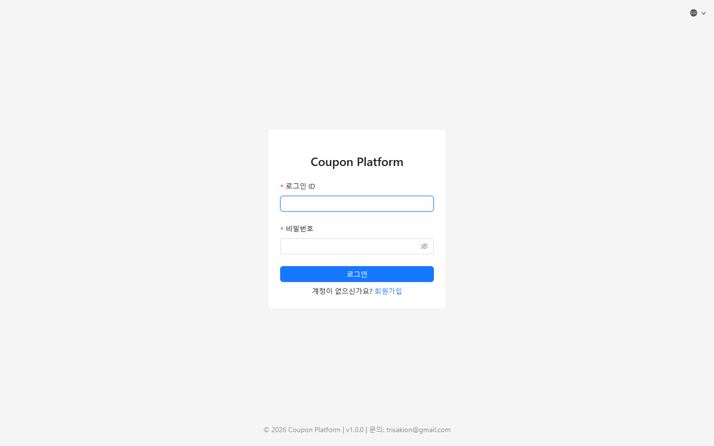 | 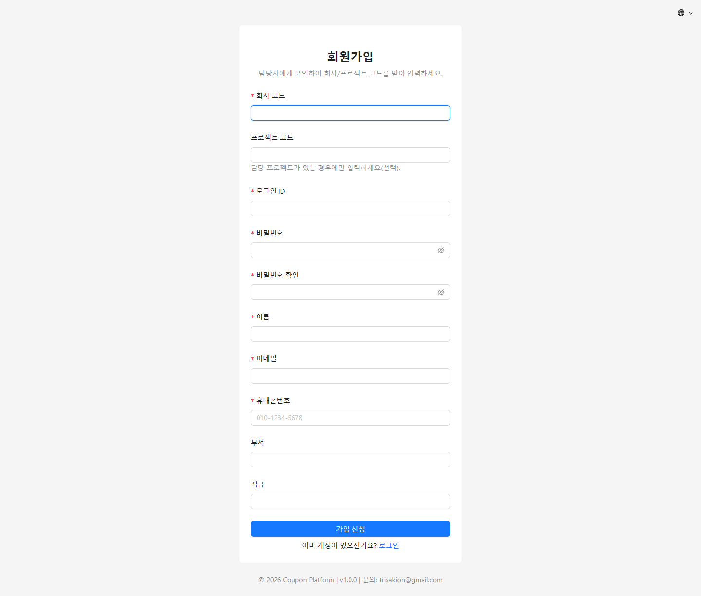 |

> **가입 승인만으로는 업무 화면이 비어 있을 수 있습니다.** 가입 승인은 "이 사람이 로그인은 할 수 있다"만 결정할 뿐, 쿠폰 도메인(캠페인/코드) 업무 권한은 별도로 SUPER_ADMIN이 프로젝트 단위로 배정해야 합니다(5.2 참고). 아직 배정받지 못한 상태에서는 회사만 있고 연결된 프로젝트가 없어, 캠페인 목록 등 프로젝트 단위 화면에 아무것도 표시되지 않습니다.

## 2.2 계정 상태

| 값  | 의미         | 로그인 가능 여부 |
| --- | ------------ | ----------------- |
| 0   | 가입승인대기 | 불가              |
| 1   | 정상(가입승인) | 가능             |
| 2   | 가입반려     | 불가              |
| 3   | 사용중지     | 불가              |

가입이 반려되었더라도 관리자가 상태를 다시 "가입승인대기" 등으로 되돌려주면 같은 아이디로 재승인 절차를 밟을 수 있습니다.

---

# 3. 화면 기본 구성

로그인하면 아래와 같은 공통 레이아웃이 나옵니다.

```
┌──────────────────────────────────────────────────────────────────────────────────┐
│  [Coupon Platform]  [회사 ▼]  [프로젝트 ▼]   [2026-07-27 15:32:10] [관리] [홍길동 ▼] │
├──────────┬───────────────────────────────────────────────────────────────────────┤
│ Sidebar  │ Content                                                               │
└──────────┴───────────────────────────────────────────────────────────────────────┘
```

- **헤더**: 왼쪽에 회사/프로젝트 선택 콤보박스가 있습니다. SUPER_ADMIN만 "전체 회사"/"전체 프로젝트"를 선택할 수 있고, 그 외 역할은 본인 소속 회사로 고정됩니다. 캠페인 목록 등 대부분의 화면은 여기서 선택한 프로젝트를 기준으로 동작하므로, **원하는 프로젝트가 먼저 선택되어 있는지 항상 확인해야 합니다** — "전체 프로젝트" 상태로는 캠페인 목록·쿠폰 사용 로그 화면에 진입할 수 없고, 프로젝트를 먼저 고르라는 안내가 표시됩니다.
- **사이드바**: "관리" 메뉴(회사/프로젝트/사용자/감사로그 — 역할에 따라 일부만 보임)와, 실제 쿠폰 운영 업무를 위한 일반 메뉴(캠페인 목록/쿠폰 사용 로그)로 나뉩니다.
- **내 계정**: 헤더 우측의 이름을 클릭하면 내 정보 조회, 비밀번호 변경, 로그아웃 메뉴가 나옵니다. 비밀번호를 변경하면 보안을 위해 그 즉시 모든 세션이 종료되므로, 변경 직후에는 다시 로그인해야 합니다.
- 관리 화면(등록·상세·수정)에 들어가 있는 동안에는 헤더의 회사/프로젝트 선택이 잠깁니다 — 작업 도중 헤더 선택이 바뀌면 보고 있는 내용과 어긋나 혼란을 줄 수 있기 때문입니다. 목록 화면에서만 자유롭게 바꿀 수 있습니다.

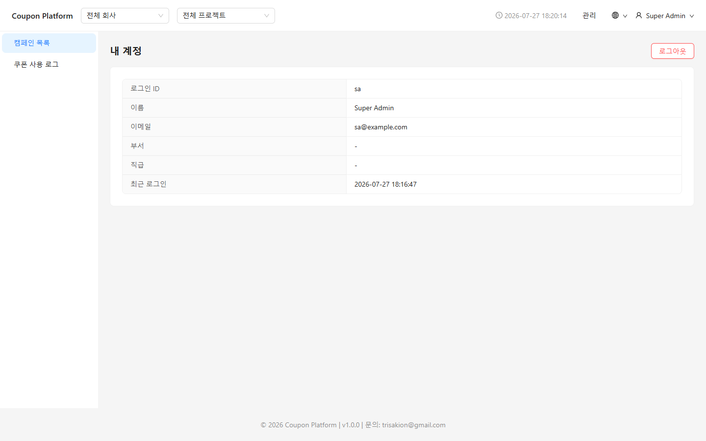
*그림 2-1. 내 계정 화면(로그인 ID, 이름, 최근 로그인 등 조회 + 로그아웃)*

---

# 4. 역할과 할 수 있는 일

Coupon Platform은 4단계 역할을 사용합니다. 숫자가 작을수록 고권한이며, 상위 역할이 하위 역할의 권한을 모두 포함하는 누적 구조입니다(`SUPER_ADMIN ⊇ DEVELOPER ⊇ MANAGER ⊇ OPERATOR`). 단, 이 누적은 회사/프로젝트 관리메뉴에는 역방향으로 적용되지 않습니다 — DEVELOPER 전용 권한(프로젝트 조회/Secret 재발급)이 MANAGER/OPERATOR에게 내려가지는 않습니다.

한 사용자가 **프로젝트마다 다른 역할**을 가질 수 있습니다(예: A 게임에서는 매니저, B 게임에서는 운영자).

| 역할 | 코드 | 한 줄 설명 |
| --- | --- | --- |
| SUPER_ADMIN | 10 | 전체 회사·프로젝트 관리자. 계정 승인, 회사/프로젝트 생성, 권한 배정 등 플랫폼 자체를 관리 |
| DEVELOPER | 20 | 프로젝트 기술 담당자. 자신이 배정된 프로젝트의 조회 + API Key/Secret 재발급 담당 |
| MANAGER | 30 | 쿠폰 도메인(캠페인/코드) 즉시 컨트롤 — 승인 절차 없이 바로 반영, 하위 역할의 요청 승인도 담당 |
| OPERATOR | 40 | 쿠폰 도메인 실무 등록 담당 — 등록/수정한 내용은 승인요청 상태로 전환되어 상위 역할의 승인이 필요 |

역할별로 어떤 기능에 접근할 수 있는지 요약하면 다음과 같습니다.

| 기능 | SUPER_ADMIN | DEVELOPER | MANAGER | OPERATOR |
| --- | :---: | :---: | :---: | :---: |
| 회사 등록/수정, 목록·상세 조회 | O (전체) | - | - | - |
| 프로젝트 등록/수정 | O | - | - | - |
| 프로젝트 목록·상세 조회 | O (전체) | O (역할보유 프로젝트만) | - | - |
| API Secret 재발급 | O | O (역할보유 프로젝트만) | - | - |
| 사용자 가입 승인/반려, 권한 배정 | O | - | - | - |
| 사용자 목록·상세 조회 | O (전체) | O (본인 회사만) | - | - |
| 감사 로그 조회 | O (전체) | O (자사만, 일부 항목 추가 제한) | - | - |
| 캠페인/코드 목록·상세 조회 | O | O | O | O |
| 캠페인 등록·수정, 코드 발급/재시도 | O (즉시 반영) | O (즉시 반영) | O (즉시 반영) | O (승인요청 상태로 전환) |
| 캠페인 승인/반려 | O | O | O | - |
| 사용 이력 / 변경 이력 / 쿠폰 사용 로그 조회 | O | O | O | O |

이 문서에서는 이 표를 바탕으로 실무에서 자주 쓰는 흐름 위주로 안내합니다.

---

# 5. 관리 업무 (SUPER_ADMIN·DEVELOPER)

## 5.1 회사·프로젝트

SUPER_ADMIN이 회사와 프로젝트(게임 타이틀)를 등록합니다. 프로젝트는 "회사 소속의 게임 하나"에 대응하며, 게임서버 연동에 필요한 `API Key`/`API Secret`도 프로젝트 단위로 발급·관리됩니다 — 자세한 발급 절차는 5.3에서 이어서 다룹니다.

| 회사 목록 (그림 3) | 프로젝트 목록 (그림 4) |
| --- | --- |
| 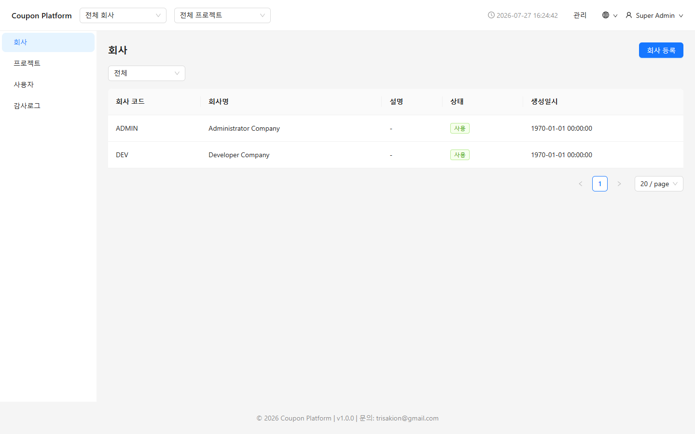 | 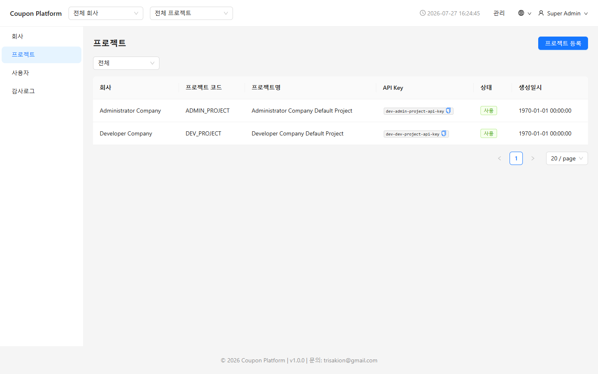 |

프로젝트를 새로 생성하면 `api_key`/`api_secret`이 서버에 의해 **즉시 자동 발급**됩니다(회사와 달리 별도 발급 버튼이 없습니다) — 이 값들 없이는 프로젝트가 만들어지지 않는 필수 항목이기 때문입니다.

## 5.2 사용자·권한

SUPER_ADMIN은 가입 신청을 승인/반려하고, 사용자별로 프로젝트마다 다른 역할(DEVELOPER/MANAGER/OPERATOR)을 부여합니다. DEVELOPER는 본인 소속 회사의 사용자 목록을 조회할 수 있습니다(수정·승인·권한배정 권한은 없습니다).

비밀번호를 잊었거나 계정에 이상이 있을 때는 SUPER_ADMIN이 강제로 비밀번호를 초기화할 수 있습니다.

| 사용자 목록 (그림 5) | 사용자 상세 — 프로젝트 권한 배정 (그림 5-1) |
| --- | --- |
| 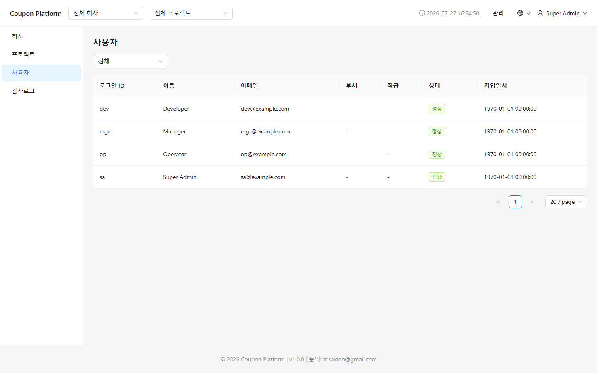 | 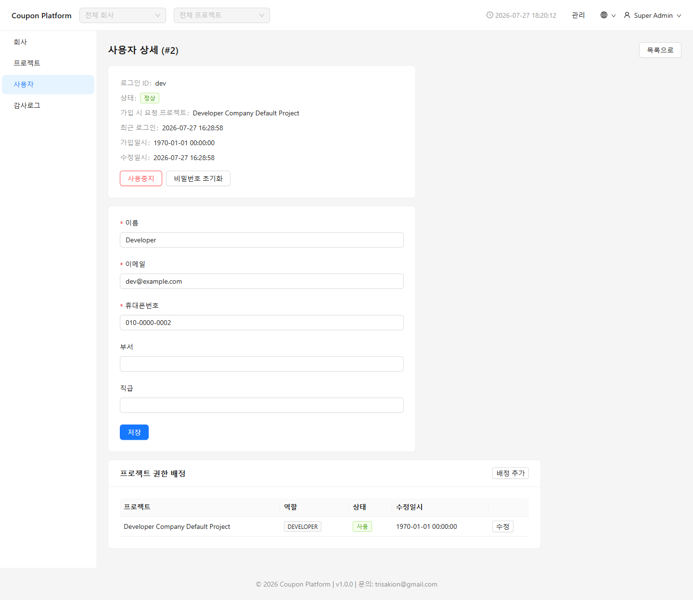 |

사용자 상세 화면 하단의 "프로젝트 권한 배정" 표에서 이 사용자가 어떤 프로젝트에 어떤 역할(DEVELOPER/MANAGER/OPERATOR)로 배정되어 있는지 확인하고, "배정 추가" 버튼으로 새 프로젝트 권한을 부여합니다. 2.1에서 언급한 "가입 승인만으로는 화면이 비어 있을 수 있다"는 안내가 바로 이 배정 여부를 가리킵니다 — 이 표에 아무 프로젝트도 없으면 캠페인 목록 등 프로젝트 단위 화면에 접근할 수 없습니다.

## 5.3 게임서버 연동 정보(API Key/Secret) 관리

프로젝트 상세 화면에서 게임서버 연동에 필요한 두 값을 확인·관리합니다.

- **API Key(`X-API-Key`)**: 프로젝트를 식별하는 공개 식별자. 목록/상세 화면에 항상 그대로 노출됩니다.
- **API Secret**: 게임서버가 요청을 서명할 때 쓰는 값. **평문은 발급/재발급 응답에 딱 한 번만 노출**되며, 이후에는 어떤 조회 화면에서도 다시 확인할 수 없습니다(발급 여부만 확인 가능합니다).

두 항목 모두 SUPER_ADMIN뿐 아니라 **그 프로젝트에 실제로 DEVELOPER 이상 권한을 가진 담당자**가 직접 관리할 수 있습니다 — 실제로 게임서버를 만드는 쪽이 매번 SUPER_ADMIN을 거치지 않고 스스로 Secret을 재발급할 수 있어야 한다는 판단입니다. 같은 회사 소속이거나 다른 프로젝트에서 DEVELOPER 이상이더라도, 해당 프로젝트에 배정되지 않았다면 이 값을 볼 수 없습니다.

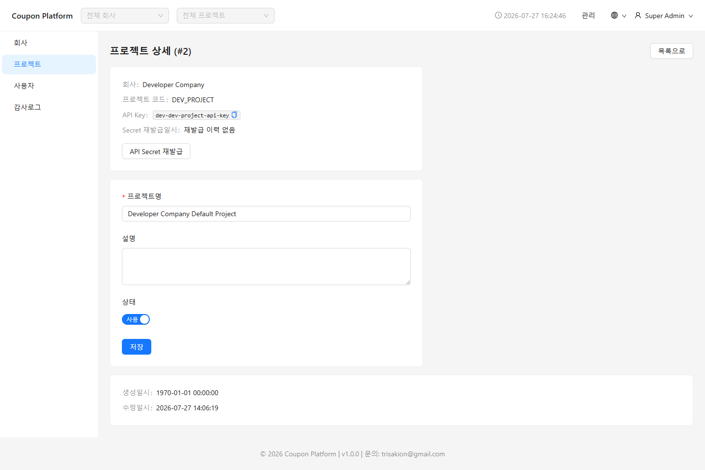
*그림 6. 프로젝트 상세 — API Key 및 재발급 버튼*

### API Secret 재발급 방법

1. 프로젝트 상세 화면에서 "API Secret 재발급" 버튼을 누릅니다.
2. 재발급 확인창에는 유예기간(기본값은 관리자에게 문의, 화면에 실제 값이 표시됩니다) 안내가 함께 뜹니다 — 재발급 이후에도 이 기간 동안은 이전 Secret으로 서명한 요청도 함께 유효합니다(아래 참고).

   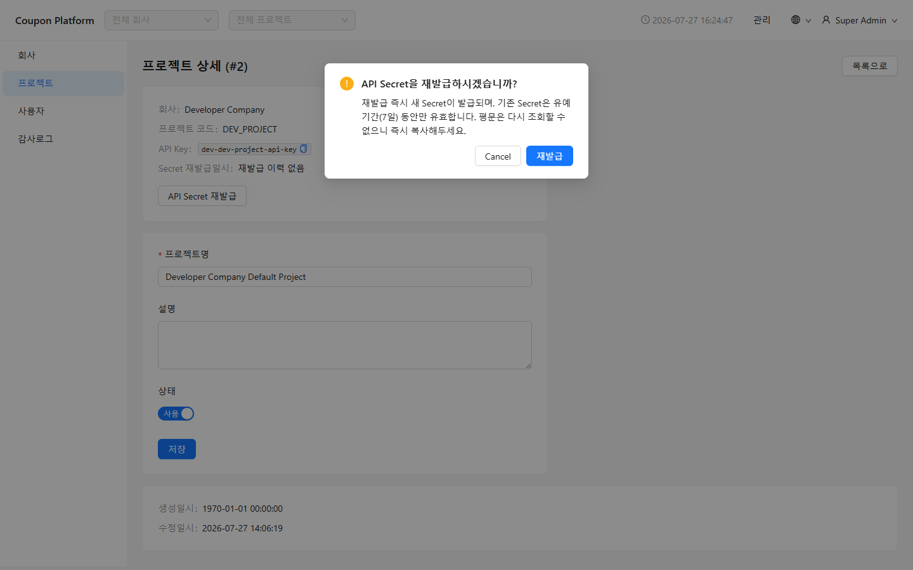
   *그림 7. API Secret 재발급 확인창*

3. 확인을 누르면 새 Secret이 생성되고, **이번 한 번만** 평문으로 화면에 표시됩니다.

   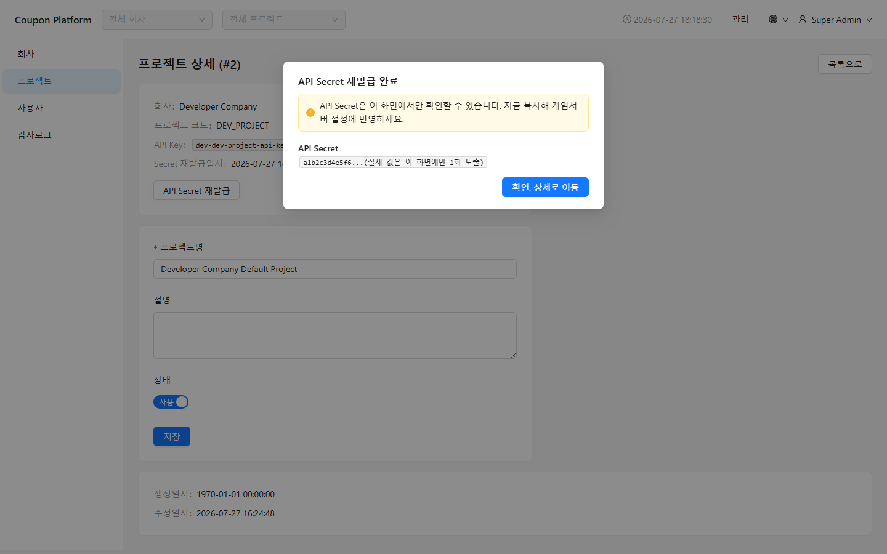
   *그림 8. 재발급된 API Secret 1회 노출 화면(실제 값은 예시를 위해 가림 처리했습니다)*

4. 이 값을 복사해 **여러분의 게임서버 설정(환경변수 등)에 그대로 붙여넣습니다.** 창을 닫으면 이후로는 어디에서도 평문을 다시 확인할 수 없습니다.

> **주의**: 재발급은 멱등하지 않습니다 — 재발급 버튼을 누를 때마다 이전 Secret이 유예기간용으로 한 칸 밀려나므로, 같은 요청을 실수로 두 번 연속 보내면 두 번째는 "다른 관리자가 먼저 수정함"으로 거부됩니다(화면을 새로고침한 뒤 다시 시도하면 됩니다). 이는 버그가 아니라, 짧은 시간에 두 번 재발급되어 아직 유효했던 이전 Secret이 흔적도 없이 사라지는 사고를 막기 위한 안전장치입니다.

**Secret 로테이션(교체)은 유예기간(Grace Period) 방식으로 동작합니다** — 재발급 직후부터 유예기간이 끝날 때까지는 새 Secret과 이전 Secret 둘 다로 서명한 요청이 통과됩니다. 게임서버 배포가 여러 대의 서버에 순차적으로 이루어지는 경우에도, 일부 서버가 아직 이전 Secret으로 서명하고 있는 동안 인증이 끊기지 않도록 하기 위한 설계입니다. 유예기간이 지나면 이전 Secret은 자동으로 폐기되며, 그 전까지는 반드시 게임서버 설정을 새 Secret으로 교체해야 합니다.

게임서버 쪽에서 이 값을 실제로 어떻게 쓰는지는 8장을 참고합니다.

---

# 6. 쿠폰 운영 업무 (전체 역할)

## 6.1 캠페인 등록과 승인 워크플로우

"캠페인"은 하나의 쿠폰 이벤트 단위입니다(사용기간, 코드 발급방식, 유저당 사용한도, 보상 내용을 포함). 사이드바의 "캠페인" 메뉴에서 목록/등록/상세를 다룹니다.

| 캠페인 목록 (그림 9) | 캠페인 등록 (그림 10) |
| --- | --- |
| 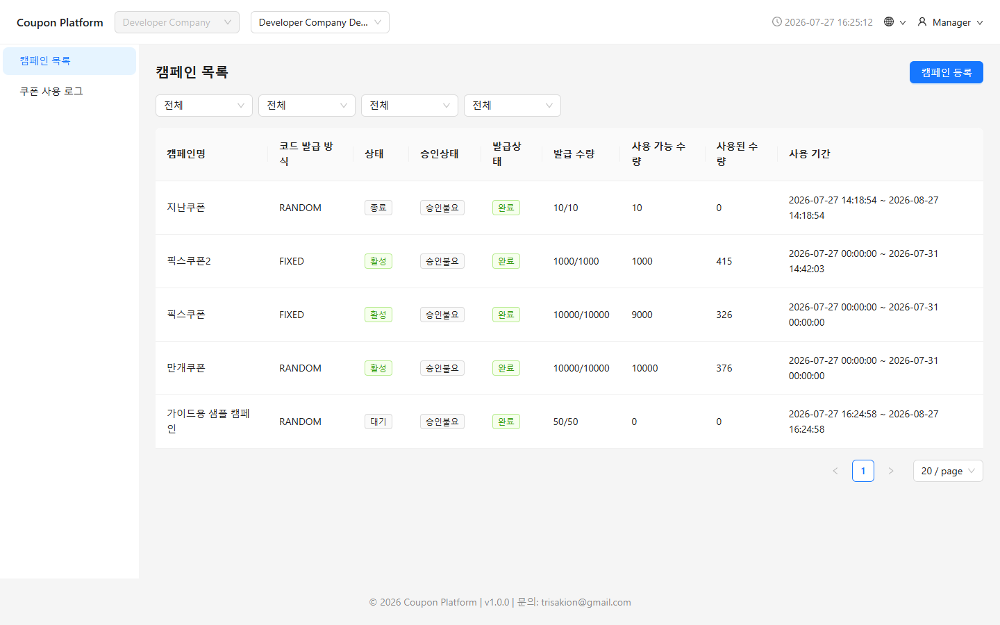 | 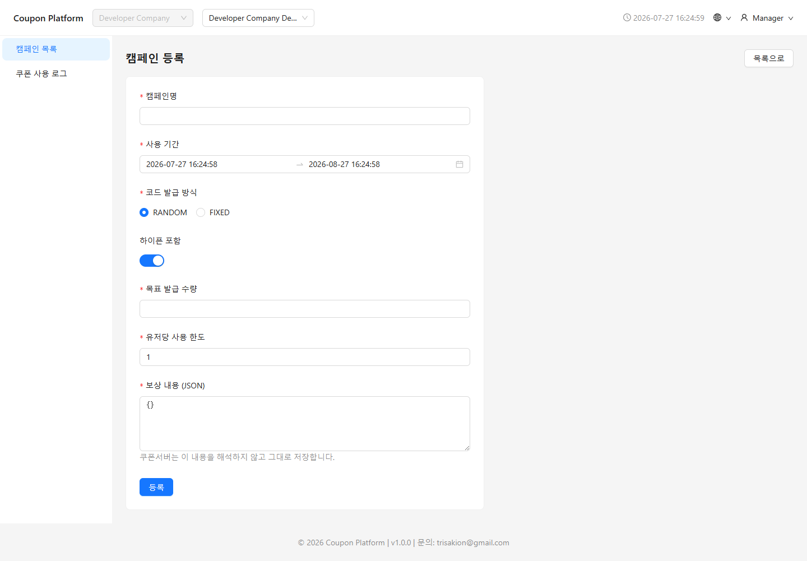 |

등록 시 입력하는 주요 항목:

| 항목 | 설명 |
| --- | --- |
| 캠페인명 | 자유 입력 |
| 사용기간 | 시작/종료 일시. 종료 일시가 시작보다 빨라서는 안 됨 |
| 코드 발급방식 | RANDOM(무작위 코드 대량생성) 또는 FIXED(관리자가 지정한 고정 코드 1개) |
| 수량 | RANDOM은 생성할 코드 개수, FIXED는 그 코드 1개가 지원할 총 사용가능 횟수(코드 개수가 아님 — 6.2 참고) |
| 유저당 사용한도 | 같은 유저가 같은 캠페인을 몇 번 사용할 수 있는지 |
| 보상 내용 | JSON 형태로 자유롭게 입력. 플랫폼은 이 내용을 해석하지 않고 그대로 저장했다가 게임서버에 그대로 돌려줍니다 — 실제 지급 처리는 게임서버가 담당합니다 |

**등록/수정한 내용이 즉시 반영되는지, 승인이 필요한지는 요청자의 역할에 따라 갈립니다.**

- MANAGER 이상이 등록/수정하면 **즉시 반영**됩니다(승인불요).
- OPERATOR가 등록/수정하면 **승인요청 상태**로 전환됩니다 — SUPER_ADMIN·DEVELOPER·MANAGER 중 누군가 캠페인 상세 화면에서 승인/반려해야 실제로 활성화할 수 있습니다. 반려된 캠페인은 OPERATOR가 다시 수정해서 재상신할 수 있습니다(수정 즉시 다시 승인요청 상태가 됩니다).
- **이미 승인된 캠페인이 활성 상태로 서비스 중인 도중 OPERATOR가 수정을 시도하면**, 저장 즉시 캠페인이 다시 승인대기 상태로 전환되면서 **자동으로 일시중지**됩니다 — 미승인 내용이 유저에게 그대로 노출되는 사고를 막기 위한 안전장치입니다. 화면에는 저장 전에 이 사실을 알리는 확인창이 먼저 뜹니다.

캠페인 상태(`활성화 전`/`활성`/`일시중지`/`종료`)는 별도 버튼으로 전환합니다. 종료된 캠페인은 어떤 수정도 다시 허용되지 않는 최종 상태입니다 — 되돌릴 수 없으니 새 캠페인을 만들어야 합니다. 또한 **사용기간이 지난 캠페인은 배치가 자동으로 종료 처리**합니다(5분 주기 점검, 별도 조작 불필요).

위 규칙을 화면 버튼 기준의 "상태 전이"와, 그와 별개 축인 "승인 워크플로우" 두 다이어그램(+ 표)으로 정리하면 다음과 같습니다.

**상태 전이**(`활성화 전`/`활성`/`일시중지`/`종료`)

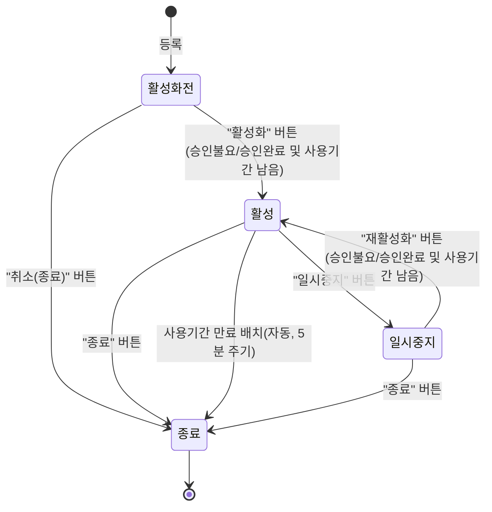
```mermaid
stateDiagram-v2
    [*] --> 활성화전 : 등록
    활성화전 --> 활성 : "활성화" 버튼<br/>(승인불요/승인완료 및 사용기간 남음)
    활성화전 --> 종료 : "취소(종료)" 버튼
    활성 --> 일시중지 : "일시중지" 버튼
    활성 --> 종료 : "종료" 버튼
    활성 --> 종료 : 사용기간 만료 배치(자동, 5분 주기)
    일시중지 --> 활성 : "재활성화" 버튼<br/>(승인불요/승인완료 및 사용기간 남음)
    일시중지 --> 종료 : "종료" 버튼
    종료 --> [*]
```

| 현재 상태 | 버튼 / 트리거 | 다음 상태 | 조건 |
| --- | --- | --- | --- |
| 활성화 전 | "활성화" | 활성 | 승인상태가 승인불요/승인완료여야 하고, 사용기간(`campaign_end`)이 아직 남아있어야 함 |
| 활성화 전 | "취소(종료)" | **종료(최종)** | 승인상태·사용기간과 무관하게 즉시 가능 — 활성화해볼 필요조차 없는 캠페인을 접을 때 씁니다 |
| 활성 | "일시중지" | 일시중지 | - |
| 활성 | "종료" | **종료(최종)** | - |
| 활성 | (자동) 사용기간 만료 배치 | **종료(최종)** | 5분 주기 점검, 별도 조작 불필요(승인불요/승인완료 상태였던 캠페인만 대상) |
| 일시중지 | "재활성화" | 활성 | 승인상태가 승인불요/승인완료여야 하고, 사용기간이 아직 남아있어야 함 |
| 일시중지 | "종료" | **종료(최종)** | - |

**종료**는 되돌릴 수 없는 최종 상태입니다 — 다시 쓰려면 새 캠페인을 만들어야 합니다. "취소(종료)"와 "종료"는 버튼 라벨이 다른 별개의 버튼이니 헷갈리지 않도록 주의하세요(전자는 활성화 전 상태에서만, 후자는 활성/일시중지 상태에서만 보입니다).

**승인 워크플로우**(`승인불요`/`승인요청`/`승인완료`/`반려`, 위 상태 전이와는 다른 축입니다)

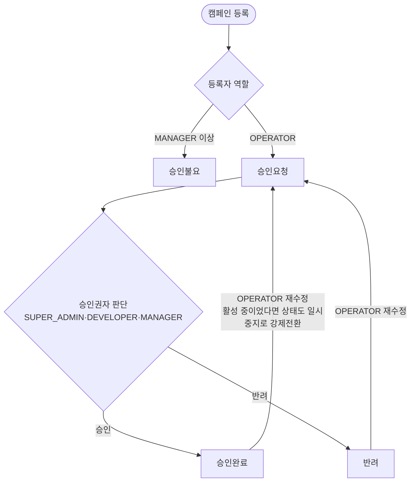
```mermaid
flowchart TD
    등록([캠페인 등록]) --> 역할분기{등록자 역할}
    역할분기 -->|MANAGER 이상| 승인불요[승인불요]
    역할분기 -->|OPERATOR| 승인요청[승인요청]
    승인요청 --> 승인판단{승인권자 판단<br/>SUPER_ADMIN·DEVELOPER·MANAGER}
    승인판단 -->|승인| 승인완료[승인완료]
    승인판단 -->|반려| 반려[반려]
    반려 -->|OPERATOR 재수정| 승인요청
    승인완료 -->|OPERATOR 재수정<br/>활성 중이었다면 상태도 일시중지로 강제전환| 승인요청
```

| 현재 상태 | 트리거 | 다음 상태 | 부수효과 |
| --- | --- | --- | --- |
| (등록) | MANAGER 이상이 등록 | 승인불요 | 승인 절차 없이 바로 시작 |
| (등록) | OPERATOR가 등록 | 승인요청 | SUPER_ADMIN/DEVELOPER/MANAGER의 승인이 필요 |
| 승인요청 | 승인 (SUPER_ADMIN·DEVELOPER·MANAGER) | 승인완료 | - |
| 승인요청 | 반려 (SUPER_ADMIN·DEVELOPER·MANAGER) | 반려 | 반려 사유 기록 |
| 승인완료 또는 반려 | OPERATOR가 캠페인 정보 수정 | 승인요청 | 수정 즉시 자동 재상신(별도 "재제출" API 없음). 그 캠페인이 이미 "활성" 중이었다면 상태까지 함께 "일시중지"로 강제 전환됩니다(재승인 전까지 유저 노출 차단) |

> 핵심은 **"상태(활성화전/활성/일시중지/종료)"와 "승인상태(승인불요/승인요청/반려)"가 서로 다른 축이라는 점**입니다. OPERATOR의 수정은 언제나 승인상태를 "승인요청"으로 되돌리고, 그 캠페인이 이미 "활성" 중이었다면 상태까지 강제로 "일시중지"로 함께 끌어내립니다 — 두 축이 맞물려야 실제로 유저에게 노출되는 "활성 + 승인불요" 상태가 됩니다.

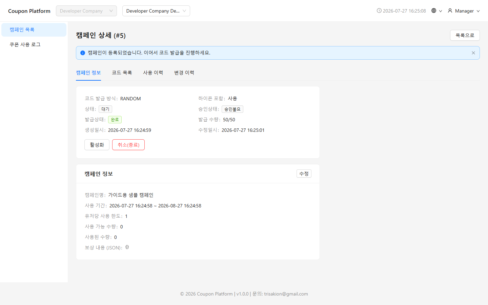
*그림 11. 캠페인 상세 — 정보 탭(상태 전환/승인 버튼, 수정 폼)*

## 6.2 쿠폰 코드 발급

캠페인을 등록한 뒤, 상세 화면의 "코드 목록" 탭에서 실제 쿠폰 코드를 발급합니다.

- **RANDOM**: "코드 발급" 버튼을 누르면 즉시 접수되고, 백그라운드에서 지정한 수량만큼 무작위 코드를 순차 생성합니다(대량 생성이라 시간이 걸릴 수 있습니다). 발급 현황(진행 중/완료/실패)이 화면에 표시되며, 실패 시 "재시도" 버튼으로 이어서 생성할 수 있습니다. 아주 드물게 발급 작업이 멈춘 것으로 보이면 "발급 중단" 버튼으로 강제 정리 후 재시도할 수 있습니다.
- **FIXED**: "코드 등록" 버튼으로 코드 값을 직접 입력해 등록합니다(예: `SUMMER2024`). 캠페인당 코드는 항상 1건뿐이지만, 등록 시 지정한 수량만큼 **서로 다른 여러 유저가 각자 독립적으로** 그 코드를 사용할 수 있습니다 — "코드 1건 = 발급된 쿠폰 1장"이 아니라 "코드 1건 = 그 코드가 지원하는 총 사용 횟수"라는 뜻입니다.

코드 목록 탭에는 "CSV 다운로드" 버튼도 있어, 발급된 코드 전체를 파일로 내려받아 별도로 관리하거나 유저에게 배포하는 용도로 쓸 수 있습니다.

코드 발급 후 상세 화면 "캠페인 정보" 탭에서 **`usable_qty`(사용가능수량)를 열어야** 실제로 게임서버가 그 코드를 사용할 수 있습니다 — 코드가 만들어진 상태와 실제 유저에게 오픈된 상태는 별개 값으로 관리됩니다(발급된 수량 이하로만 열 수 있습니다).

| 발급 전 — 대기 (그림 12) | 발급 완료 후 (그림 13) |
| --- | --- |
| 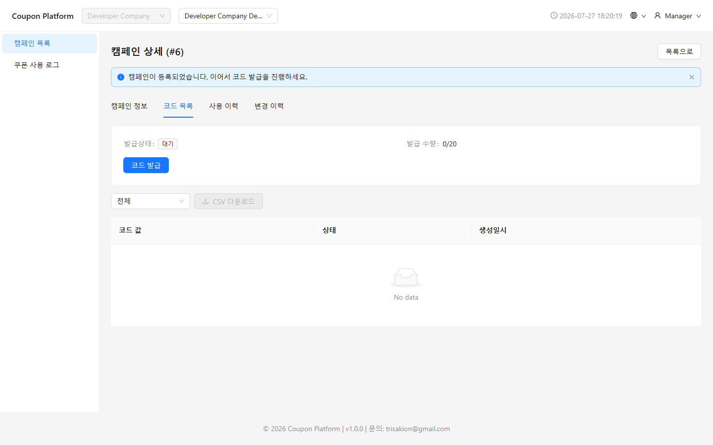 | 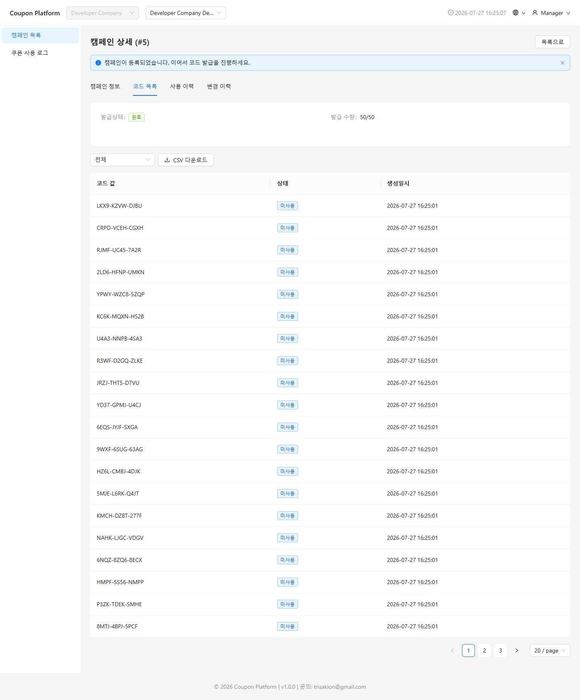 |

발급 전에는 "발급상태: 대기"와 "코드 발급" 버튼만 보이고 코드 목록은 비어 있습니다. "코드 발급"을 누르면 백그라운드 생성이 시작되고, 완료되면 오른쪽 그림처럼 목표 수량만큼의 코드가 "미사용" 상태로 채워집니다.

## 6.3 사용 이력 / 변경 이력 / 쿠폰 사용 로그 조회

캠페인 상세 화면에는 조회 전용 탭 2개가 더 있습니다.

- **사용 이력**: 이 캠페인의 쿠폰이 실제로 소모된 기록입니다. 유저 ID, 지급결과 통보(confirm) 여부로 필터링할 수 있습니다.
- **변경 이력**: 이 캠페인의 등록/수정/상태변경/승인/반려 이력입니다. 각 시점의 캠페인 전체 스냅샷이 남아, 언제 무엇이 바뀌었는지 시간순으로 추적할 수 있습니다.

| 사용 이력 탭 (그림 14) | 변경 이력 탭 (그림 15) |
| --- | --- |
| 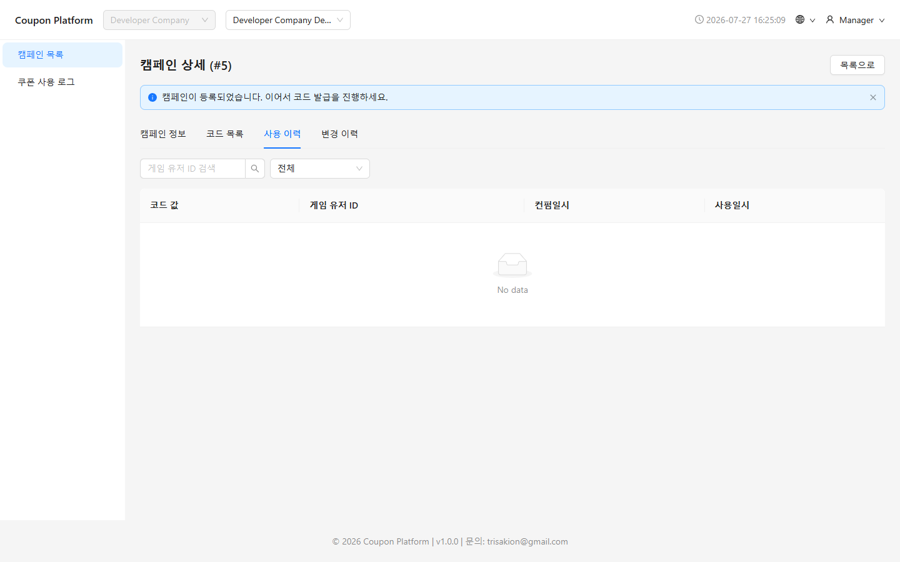 | 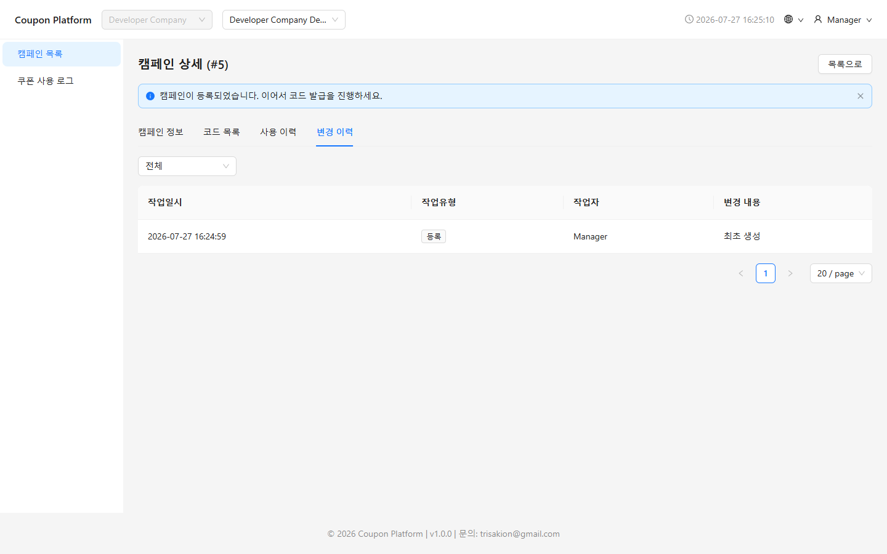 |

사이드바의 별도 화면 "쿠폰 사용 로그"는 특정 캠페인에 한정되지 않고 **프로젝트 전체**의 사용 시도를 보여줍니다 — 성공한 사용뿐 아니라 실패한 시도(존재하지 않는 코드, 이미 소모된 코드, 한도 초과 등)까지 전부 남아 있어, 코드 브루트포스 시도나 이상 징후를 확인하거나 게임서버 개발자의 연동 문의에 대응할 때 유용합니다.

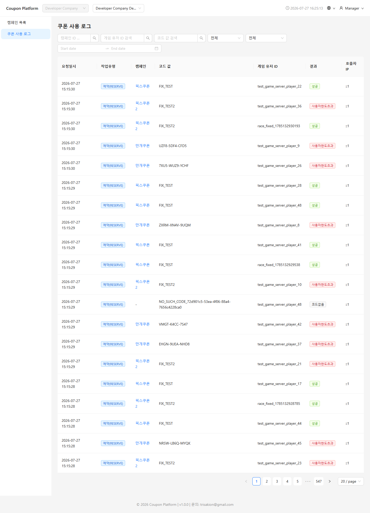
*그림 16. 쿠폰 사용 로그(프로젝트 전체, 실패 시도 포함)*

---

# 7. 감사 로그 (SUPER_ADMIN·DEVELOPER)

회사/프로젝트/사용자/권한 배정 등 관리 데이터의 모든 변경 이력이 수정·삭제 없이 계속 쌓이기만 하는 방식(Append-Only)으로 기록됩니다. 변경 전/후 값을 함께 확인할 수 있어, "언제 누가 무엇을 바꿨는지" 추적이 필요할 때 사용합니다.

로그 자체가 수정·삭제되지 않으므로, 운영 사고가 발생했을 때 "그 값을 누가 언제 바꿨는지"를 사후에도 그대로 신뢰할 수 있는 근거 자료로 쓸 수 있습니다.

DEVELOPER는 본인 소속 회사의 로그만 조회할 수 있고, 그중 프로젝트/권한배정 관련 로그는 본인이 실제로 담당하는(DEVELOPER 이상 권한을 가진) 프로젝트로 한 번 더 좁혀집니다 — 담당하지도 않는 프로젝트의 변경 이력까지 보이지 않도록 하기 위함입니다.

캠페인/쿠폰코드 자체의 변경 이력은 이 화면이 아니라 6.3의 캠페인 상세 "변경 이력" 탭에서 확인합니다(별도 영역으로 분리 관리됩니다).

| 감사로그 목록 (그림 17) | 감사로그 상세 — 변경 전/후 비교 (그림 18) |
| --- | --- |
| 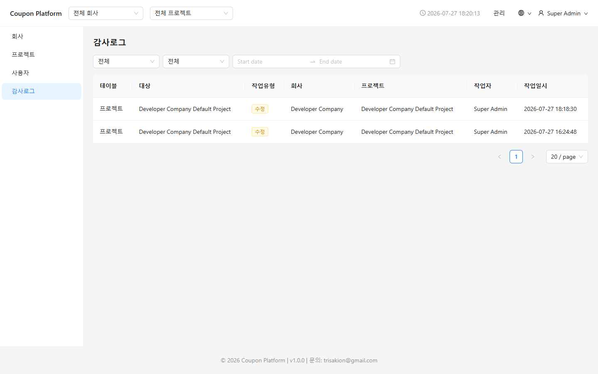 | 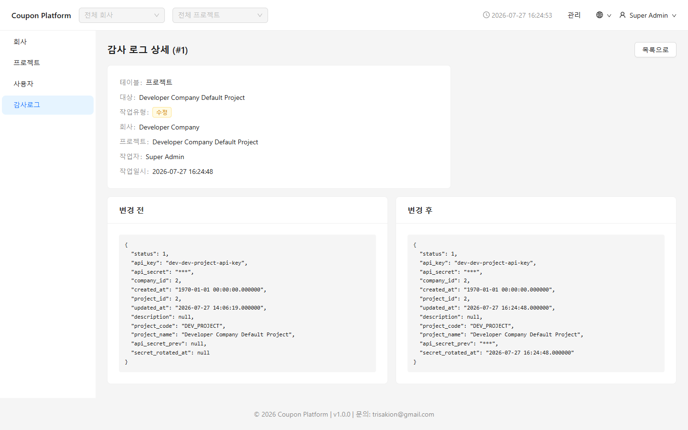 |

목록 화면에서는 테이블/작업유형/회사/프로젝트/작업자/작업일시로 필터링해 원하는 변경 건을 찾고, 상세 화면에서 변경 전/후 값을 비교합니다(`api_secret`처럼 민감한 값은 `***`로 마스킹되어 기록됩니다).

---

# 8. 게임서버 개발자를 위한 연동 안내

이 장은 Coupon Platform과 여러분의 게임서버를 실제로 연결하는 **백엔드 개발자**를 위한 내용입니다. 관리 콘솔 사용자 인증(로그인 ID/비밀번호, JWT)과는 완전히 별개의 인증 방식을 쓴다는 점에 유의합니다 — 게임서버는 5.3에서 발급받은 **API Key + API Secret**으로만 인증합니다.

## 8.1 공통 API 계약

Coupon Platform이 게임서버를 위해 노출하는 API(쿠폰 사용 관련)는 아래 세 개입니다. 전부 `POST`이고 `/v1` 버전 접두어가 붙습니다.

```text
POST /v1/coupons/{code}/reserve      쿠폰 사용(소모 확정)
POST /v1/coupons/{code}/confirm      지급 결과 통보
POST /v1/coupons/unconfirmed         confirm이 안 온 소모 건 조회(재처리용)
```

응답은 아래 봉투(envelope) 형식을 공통으로 따릅니다.

```json
{
  "result": 0,
  "data": { "...": "..." }
}
```

- `result`가 `0`이면 성공, 그 외 값이면 실패입니다. HTTP Status Code와 Result Code를 함께 확인해야 합니다(HTTP만으로는 실패 사유를 구분할 수 없는 경우가 있습니다).
- 성공 시 항상 `result: 0`과 함께 HTTP 200(또는 202)을 반환하며, 비즈니스 오류를 HTTP 200으로 감춰서 반환하지 않습니다.
- 요청 파라미터는 GET 쿼리스트링이 아니라 **항상 JSON 바디**로 전달합니다(조회 API인 `/coupons/unconfirmed`도 마찬가지입니다) — URL에 유저 식별자 같은 값이 남아 접근 로그 등에 그대로 찍히는 것을 피하기 위한 설계입니다.

HTTP Status Code는 Result Code의 범위에 따라 아래처럼 매핑됩니다.

| HTTP Status | Result Code 범위 | 의미 |
| --- | --- | --- |
| 200 / 202 | 0 | 정상 처리(202는 비동기 접수) |
| 400 | 30000~39999 | 입력값/쿠폰 사용 제약 오류 |
| 401 | 10000~19999 | 인증 실패 |
| 404 | 31000~31999 | 대상 없음(Result Code 범위 안에서 세분화) |
| 429 | 40000~49999 | 요청 제한 초과 |
| 500 | 50000~59999 | 서버 내부 오류 |

> 31000번대는 30000~39999 범위에 포함되지만, HTTP Status는 400이 아니라 **404가 우선 적용**됩니다. 즉 표는 위에서 아래로 갈수록 더 넓은 범위가 아니라, **좁은 범위(31000번대)가 넓은 범위(30000번대)보다 우선한다**는 뜻으로 읽어야 합니다.

게임서버 연동 시 자주 마주치는 오류 코드는 아래와 같습니다.

| Result Code | HTTP | 의미 |
| --- | --- | --- |
| 30001 | 400 | 필수 입력값 누락(`game_user_id` 등) |
| 31005 | 404 | 쿠폰 코드 없음(오타/존재하지 않는 코드) |
| 31006 | 404 | 소모 기록 없음(reserve 없이 confirm 시도) |
| 33001 | 400 | 코드 이미 소모됨/중지됨 |
| 33002 | 400 | 캠페인 사용 불가(비활성/기간 외/오픈 수량 소진) |
| 33003 | 400 | 이 유저의 사용 한도 초과 |
| 40001 | 429 | 요청 제한 초과(아래 참고) |

인증 단계 자체가 실패하면 위 표에 없더라도 아래 코드가 공통으로 반환될 수 있습니다(8.2 참고).

| Result Code | HTTP | 의미 |
| --- | --- | --- |
| 10010 | 401 | API Key 없음/유효하지 않음 |
| 10011 | 401 | 서명(Signature) 불일치 |
| 10012 | 401 | 필수 인증 헤더 누락/형식 오류 |
| 10013 | 401 | Timestamp 허용범위 초과 |
| 10014 | 401 | 프로젝트 사용중지 |
| 10015 | 401 | Nonce 재사용 감지(재전송 의심) |

**요청 제한(Rate Limit)**: 프로젝트(API Key) 단위로 순간 최대 처리량과 초당 처리율이 정해져 있습니다. 이는 오남용 방지가 아니라 특정 게임서버의 트래픽 폭주로부터 플랫폼 전체를 보호하기 위한 것이며, 정상적인 서비스 트래픽이라면 거의 마주칠 일이 없는 여유 있는 값으로 설정되어 있습니다. 초과 시 429와 함께 `Retry-After` 헤더(최소 대기 초)가 함께 옵니다.

## 8.2 S2S 인증 서명 만들기

Coupon Platform은 API Secret 원문을 요청에 절대 싣지 않습니다 — 대신 매 요청마다 **HMAC-SHA256으로 서명한 값**을 실어 보냅니다. 아래 4개 헤더가 모든 요청에 필요합니다.

| 헤더 | 설명 |
| --- | --- |
| `X-API-Key` | 발급받은 API Key |
| `X-API-Timestamp` | 요청 생성 시각, Unix Epoch 초 단위 정수 문자열 |
| `X-API-Nonce` | 요청마다 새로 생성하는 1회성 임의 문자열(UUID 권장) |
| `X-API-Signature` | 아래 규칙으로 계산한 서명(hex) |

서명 대상 문자열(string to sign)은 다음과 같이 줄바꿈(`\n`)으로 이어 붙여 구성합니다.

```text
stringToSign = HTTP_METHOD + "\n"
             + PATH (쿼리스트링 제외) + "\n"
             + RAW_QUERY_STRING (없으면 빈 문자열) + "\n"
             + X-API-Timestamp + "\n"
             + X-API-Nonce + "\n"
             + RAW_BODY (없으면 빈 문자열)

X-API-Signature = HMAC-SHA256(secret, stringToSign)  // hex 인코딩
```

Node.js 참고 구현입니다.

```js
const { createHmac, randomUUID } = require('crypto');

function buildS2sHeaders(apiKey, apiSecret, method, path, rawBody) {
  const timestamp = Math.floor(Date.now() / 1000).toString();
  const nonce = randomUUID();
  const stringToSign = [method, path, '', timestamp, nonce, rawBody].join('\n');
  const signature = createHmac('sha256', apiSecret).update(stringToSign).digest('hex');

  return {
    'Content-Type': 'application/json',
    'X-API-Key': apiKey,
    'X-API-Timestamp': timestamp,
    'X-API-Nonce': nonce,
    'X-API-Signature': signature,
  };
}
```

다른 언어/프레임워크를 쓰더라도 같은 로직(HMAC-SHA256, 줄바꿈 구분 문자열, hex 인코딩)만 그대로 옮기면 됩니다. 실수하기 쉬운 지점 세 가지를 짚어드립니다.

> **RAW_BODY는 "보낼 그 문자열 그대로" 서명해야 합니다.** JSON을 만든 뒤 서명용으로 다시 직렬화(re-serialize)하면 키 순서나 공백 차이로 서버가 계산한 서명과 어긋나 정상 요청도 거부될 수 있습니다. 서명에 쓴 문자열과 실제로 전송하는 바디 문자열이 완전히 동일해야 합니다.
>
> **`{code}` 경로에 URL 인코딩이 필요한 문자가 있다면, 서명에 넣는 PATH와 실제로 요청을 보내는 URL의 경로가 정확히 같은 문자열이어야 합니다.** 서버는 받은 경로 문자열을 그대로 서명 검증에 쓸 뿐 별도로 디코딩하지 않습니다.
>
> **`X-API-Timestamp`는 서버와 시계가 크게 어긋나면 거부됩니다**(허용 오차를 벗어나면 인증 실패). 게임서버가 NTP 등으로 시각 동기화를 유지하고 있는지 확인하세요.

> **시각 동기화 오차가 실제로 발생하는 경우**: 게임서버가 이 오차로 인증에 계속 실패한다면 서버 시각을 먼저 점검하고, 필요하면 운영 담당자에게 허용 오차 값 조정이 가능한지 문의해 주세요.

동일한 로직을 그대로 구현한 재사용 가능 참고 SDK(외부 의존성 없이 Node.js 내장 기능만 사용)가 [`CouponS2sClient.ts`](../test_game_server/src/sdk/CouponS2sClient.ts)로 제공되니, 처음부터 직접 구현하는 대신 참고하시거나 그대로 가져다 쓰셔도 됩니다. TypeScript를 쓰지 않는 프로젝트라면 컴파일된 [`CouponS2sClient.js`](../test_game_server/src/sdk/CouponS2sClient.js)를 그대로 가져다 써도 됩니다(같은 폴더의 `.d.ts`가 에디터 타입 지원도 함께 제공합니다).

## 8.3 쿠폰 사용 API (reserve / confirm / 미컨슘 조회)

정상 흐름과, 게임서버 장애 시 복구 흐름을 시퀀스로 정리하면 다음과 같습니다.

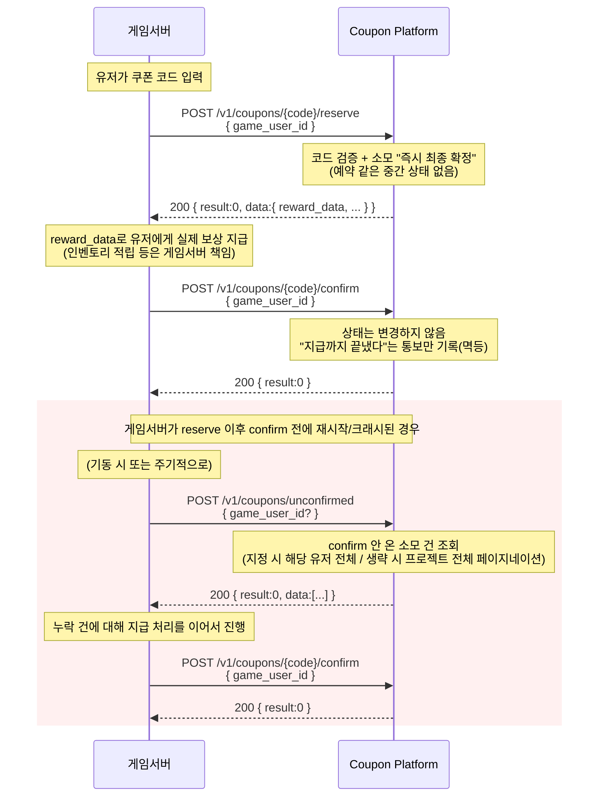
```mermaid
sequenceDiagram
    participant G as 게임서버
    participant C as Coupon Platform

    Note over G: 유저가 쿠폰 코드 입력
    G->>C: POST /v1/coupons/{code}/reserve<br/>{ game_user_id }
    Note over C: 코드 검증 + 소모 "즉시 최종 확정"<br/>(예약 같은 중간 상태 없음)
    C-->>G: 200 { result:0, data:{ reward_data, ... } }
    Note over G: reward_data로 유저에게 실제 보상 지급<br/>(인벤토리 적립 등은 게임서버 책임)
    G->>C: POST /v1/coupons/{code}/confirm<br/>{ game_user_id }
    Note over C: 상태는 변경하지 않음<br/>"지급까지 끝냈다"는 통보만 기록(멱등)
    C-->>G: 200 { result:0 }

    rect rgb(255, 240, 240)
    Note over G,C: 게임서버가 reserve 이후 confirm 전에 재시작/크래시된 경우
    Note over G: (기동 시 또는 주기적으로)
    G->>C: POST /v1/coupons/unconfirmed<br/>{ game_user_id? }
    Note over C: confirm 안 온 소모 건 조회<br/>(지정 시 해당 유저 전체 / 생략 시 프로젝트 전체 페이지네이션)
    C-->>G: 200 { result:0, data:[...] }
    Note over G: 누락 건에 대해 지급 처리를 이어서 진행
    G->>C: POST /v1/coupons/{code}/confirm<br/>{ game_user_id }
    C-->>G: 200 { result:0 }
    end
```

### Reserve — 쿠폰 사용(소모 확정)

```http
POST /v1/coupons/{code}/reserve
{ "game_user_id": "player_1001" }
```

**호출 즉시 소모가 최종 확정됩니다.** 예약 같은 중간 상태 없이, 성공하면 그 자리에서 코드가 소모 완료 처리됩니다. 응답에 `reward_data`(캠페인 등록 시 입력한 보상 내용)가 그대로 포함되므로, 게임서버는 이 응답만으로 즉시 지급 처리를 진행할 수 있습니다.

```json
{
  "result": 0,
  "data": {
    "coupon_code_usage_id": 9000,
    "coupon_campaign_id": 100,
    "code_value": "23A4-B7C9-DEF2",
    "game_user_id": "player_1001",
    "reward_data": { "item_id": 5001, "qty": 3 },
    "created_at": "2026-07-27 10:00:00"
  }
}
```

### Confirm — 지급 결과 통보

```http
POST /v1/coupons/{code}/confirm
{ "game_user_id": "player_1001" }
```

reserve로 이미 소모는 끝났으므로, confirm은 코드/캠페인의 어떤 상태도 바꾸지 않습니다. "지급까지 완료했다"는 결과를 통보하는 용도일 뿐입니다. 여러 번 호출해도 무해합니다(멱등).

### 미컨슘 조회 — confirm이 안 온 건 재처리

```http
POST /v1/coupons/unconfirmed
{ "game_user_id": "player_1001" }
```

reserve는 성공했는데 confirm을 보내지 못한 채로 게임서버가 재시작되거나 크래시된 경우를 위한 조회 API입니다. `game_user_id`를 지정하면 그 유저의 미통보 건 전체를(페이지네이션 없이), 생략하면 프로젝트 전체를 오래된 순으로 페이지네이션 조회합니다. 게임서버가 기동 시 또는 주기적으로 이 API를 호출해, 남아있는 건에 대해 지급 처리를 이어서 진행하고 confirm을 다시 보내는 방식으로 사용합니다.

## 8.4 재시도와 멱등성 — 반드시 알아야 할 함정

네트워크 타임아웃이나 장애로 응답을 못 받았을 때 **reserve를 그대로 재시도해도 안전한지는 캠페인 설정에 따라 다릅니다.**

- **유저당 사용한도(`use_limit_per_user`)가 1인 캠페인(RANDOM/FIXED 공통)**: 동일한 코드+동일한 `game_user_id`로 재시도하면 새로 소모하지 않고 **최초 성공 때와 완전히 동일한 응답**을 그대로 다시 돌려줍니다(멱등). 안전하게 재시도해도 됩니다.
- **유저당 사용한도가 1보다 큰 캠페인(FIXED만 해당)**: "이게 재시도인지, 유저가 정말 한 번 더 쓴 것인지" 서버가 구분할 방법이 없어 이 멱등 처리가 적용되지 않습니다. 재시도도 그냥 새로운 소모 1건으로 카운트됩니다 — 한도 안이면 새로 성공하고, 한도를 넘으면 33003으로 실패합니다. **이런 캠페인에서 응답을 못 받은 요청을 무작정 재시도하면 유저의 한도를 의도치 않게 두 번 소모시킬 수 있습니다.** 재시도 전에 8.3의 미컨슘 조회로 실제 소모 여부를 먼저 확인하는 것을 권장합니다.

> **자주 헷갈리는 질문**: "A유저가 어떤 코드로 사용요청을 보냈고, 1초 뒤 완전히 동일한 요청이 다시 들어오면 결과는 어떻게 되나요?" — 위 기준대로, 그 캠페인의 유저당 사용한도가 1이면 **오류 없이 최초와 동일한 성공 응답**이 돌아옵니다(중복 소모가 아닙니다). 한도가 1보다 큰 FIXED 캠페인이면 **정상적인 두 번째 소모로 처리**됩니다(한도 내라면 성공, 초과라면 33003).

**nonce는 재시도할 때도 매번 새로 생성해야 합니다.** nonce는 재전송 공격을 막기 위한 값이라, 같은 nonce로 두 번째 요청을 보내면(설령 재시도 의도였더라도) 재전송으로 간주되어 그 요청 자체가 인증 단계에서 거부됩니다(10015). 즉 "같은 요청을 그대로 다시 보내면 안전하게 멱등 처리된다"는 것은 **비즈니스 로직(코드+유저 조합) 수준의 이야기**이고, HTTP 요청 자체는 매번 새로운 timestamp/nonce/서명으로 새로 만들어 보내야 합니다.

## 8.5 연동 절차 요약 (체크리스트)

1. Coupon Platform 운영 담당자에게 회사/프로젝트 생성을 요청하거나, 직접 SUPER_ADMIN 권한으로 프로젝트를 생성합니다(5.1).
2. 프로젝트 상세 화면에서 **API Key/Secret**을 확인하고, 게임서버 환경변수 등에 안전하게 보관합니다(5.3).
3. 8.2의 서명 규칙대로 요청 헤더를 만드는 로직을 게임서버에 구현합니다(참고 SDK 재사용 가능).
4. 관리 콘솔에서 캠페인을 등록하고 쿠폰 코드를 발급합니다(6.1~6.2). 유저에게 오픈하기 전, `usable_qty`가 열려 있고 캠페인 상태가 "활성"인지 확인합니다.
5. 유저가 코드를 입력하는 시점에 `POST /v1/coupons/{code}/reserve`를 호출하고, 응답의 `reward_data`로 지급 처리 후 `POST /v1/coupons/{code}/confirm`을 호출합니다.
6. 게임서버 기동 시(또는 주기적으로) `POST /v1/coupons/unconfirmed`로 confirm 누락 건을 조회해 재처리합니다.
7. 운영 중 실패 사례를 확인해야 하면 관리 콘솔의 "쿠폰 사용 로그" 화면(6.3)에서 캠페인/유저/코드값/기간으로 필터링해 조회합니다.

---

# 9. 자주 묻는 질문

**Q. 회원가입 화면에서 회사코드/프로젝트코드를 모르겠어요.**
운영 담당자(SUPER_ADMIN)에게 문의해 코드를 받아야 합니다. 로그인 전 화면이라 목록이 공개되지 않습니다.

**Q. 로그인이 안 됩니다.**
계정 상태(가입승인대기/반려/사용중지)에 따라 각각 다른 안내 메시지가 표시됩니다. 승인대기 상태라면 담당자의 승인을 기다려야 합니다.

**Q. 가입 승인은 됐는데 캠페인 목록이 비어 있어요.**
프로젝트 단위 권한(DEVELOPER/MANAGER/OPERATOR)이 아직 배정되지 않은 상태일 수 있습니다(2.1 참고). SUPER_ADMIN에게 권한 배정을 요청해야 합니다.

**Q. 캠페인을 등록/수정했는데 반영이 안 됩니다.**
OPERATOR 권한으로 등록/수정하면 승인요청 상태로만 전환됩니다(6.1 참고). MANAGER 이상의 승인이 필요합니다.

**Q. reserve 호출이 계속 33002로 실패합니다.**
캠페인 상태가 "활성"이 아니거나, 사용기간 밖이거나, `usable_qty`(오픈 수량)가 소진됐을 가능성이 높습니다. 캠페인 상세 화면에서 상태/기간/수량을 먼저 확인하세요.

**Q. reserve/confirm 호출이 계속 인증 실패(401)로 떨어집니다.**
서명 계산 로직(8.2)을 다시 점검하세요 — RAW_BODY 재직렬화 여부, 경로 인코딩 일치 여부, 서버와의 시각 동기화 순으로 확인하는 것이 가장 빠릅니다. `X-API-Key` 자체가 틀렸다면 10010, 서명 불일치는 10011, 헤더 누락은 10012, 시각 오차는 10013으로 각각 다르게 응답되니 어떤 코드인지부터 확인하세요.

**Q. API Secret을 재발급했더니 기존 게임서버 인스턴스 일부가 인증 실패로 떨어집니다.**
재발급 직후에는 유예기간 동안 이전 Secret도 함께 유효하므로 정상적으로는 즉시 끊기지 않습니다(5.3 참고). 유예기간이 이미 지났거나, 애초에 새 Secret을 게임서버 설정에 반영하지 않았는지 확인해 보세요.

---

# 10. 문의

이 문서에서 다루지 않는 내용이나 오류가 발생하면 화면 하단 푸터에 표시된 문의처로 연락하거나, Coupon Platform 운영 담당자에게 문의해 주세요.
