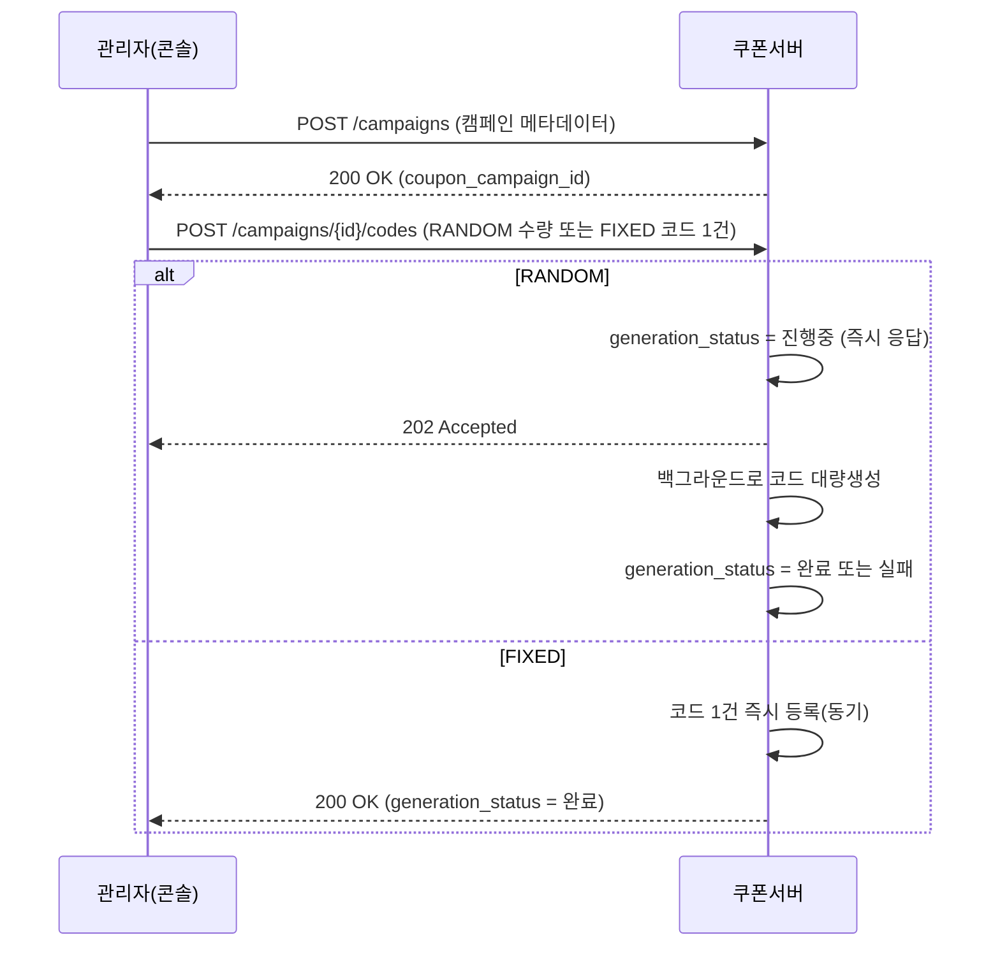
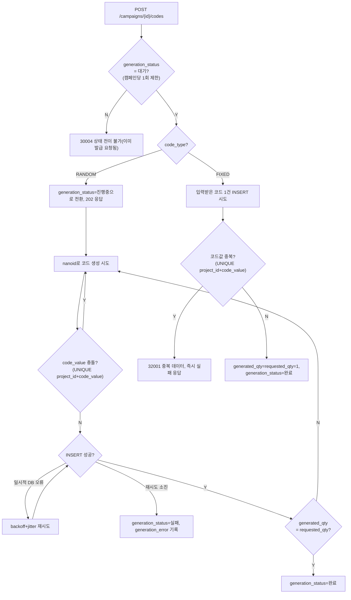

# 04_COUPON_ISSUANCE_SCENARIO.md

## 개요

본 문서는 관리자가 쿠폰 캠페인을 만들고 실제 쿠폰 코드를 발급하는 흐름(캠페인 생성 → 코드 발급 → 생성 실패 시 재시도)을 정리한다. API 엔드포인트/result 코드 등 상세 스펙이 아니라 **흐름 자체의 설계 근거**를 다룬다 — 상세 API 스펙은 [16_CAMPAIGN_API.md](./16_CAMPAIGN_API.md)에서 정리한다.

관련 테이블: `database/tables/coupon_campaign.sql`, `coupon_code.sql`

---

# 1. 왜 캠페인 생성과 코드 발급을 나누는가

캠페인 메타데이터(이름/기간/수량/보상 등록)와 실제 쿠폰 코드 생성은 하나의 API 호출로 묶지 않고 **별도 API로 분리**한다.

```text
POST /campaigns              캠페인 메타데이터만 생성
POST /campaigns/{id}/codes   코드 발급(RANDOM 대량생성 또는 FIXED 단일 코드 등록)
```

RANDOM 대량생성은 수천~수만 건을 만들 수 있어 시간이 걸리고 실패 가능성도 있다. 캠페인 생성 요청 안에 이 처리까지 묶으면 캠페인 생성 자체가 타임아웃/부분실패 위험을 떠안게 된다. 분리하면 캠페인은 항상 즉시·단순하게 생성되고, 코드 발급은 독립적으로 재시도·모니터링할 수 있다. `coupon_campaign.requested_qty`(목표)/`generated_qty`(실제) 컬럼이 이미 "코드 발급 전 캠페인"이라는 상태를 표현할 수 있게 설계돼 있었다는 점도 이 분리와 자연스럽게 맞는다.

캠페인 승인 워크플로우(`approval_status`)는 코드 발급과 독립적으로 동작한다 — 승인 여부와 무관하게 코드는 미리 만들어 둘 수 있으며, `coupon_campaign.status`가 활성(2)으로 전환되는 시점에만 승인 여부(`approval_status IN (1,3)`)를 체크한다(자세한 내용은 `coupon_campaign.sql` 헤더 주석, `03_DATABASE_SCHEMA.md` 참고).

---

# 2. 기본 흐름

`code_type`에 따라 코드 발급 처리 방식이 근본적으로 다르다.

```text
RANDOM : 대량생성 → 비동기 처리 (generation_status: 대기 → 진행중 → 완료/실패)
FIXED  : 관리자가 코드 1건을 직접 입력 → 동기 처리 (즉시 완료). 여러 사용자가 같은 코드를 공유하므로(캠페인당 코드 1건) 목록 등록 개념 자체가 없다
```

**왜 FIXED는 캠페인당 코드 1건뿐인가**: FIXED 코드는 여러 사용자가 같은 코드를 공유한다. 총 사용 가능 수량은 이미 캠페인 레벨의 `usable_qty`/`used_qty`가, 동일 유저 재사용 한도는 `use_limit_per_user`가 각각 제어하므로, 코드 문자열 자체를 여러 개 두어야 할 이유가 없다(채널별로 다른 코드를 배포하고 싶다면 캠페인을 나누면 된다). 그래서 FIXED는 코드 목록 등록이 아니라 단일 코드 등록으로 설계한다. `requested_qty`도 FIXED에서는 "코드 개수"가 아니라 시스템이 항상 `1`로 고정해서, RANDOM과 동일한 "`generated_qty`==`requested_qty` → 완료" 판정 로직을 재사용하기 위한 용도일 뿐이다.

캠페인당 코드 발급 요청(job)은 **1회만 허용**한다(추가 발급/top-up 불가) — job과 campaign이 항상 1:1 관계이므로, 별도 진행상태 추적 테이블 없이 `coupon_campaign.generation_status`/`generation_error` 컬럼만으로 표현 가능하다.



## 2.1 처리 로직 분기



## 2.2 안정성 — 코드 생성 실패 처리

RANDOM 대량생성 전용이다. FIXED는 코드 1건을 동기로 즉시 INSERT 시도하는 것뿐이라 아래 backoff 재시도/`generation_status=4`(실패) 전이 대상이 아니다 — 실패(코드값 중복)하면 `generation_status`를 `1`(대기)로 그대로 둔 채 즉시 오류 응답하고, 관리자가 다른 값으로 [16_CAMPAIGN_API.md](./16_CAMPAIGN_API.md) 3.1을 다시 호출하면 된다.

| 실패 유형 | 원인 | 처리 |
|-----------|------|------|
| 코드값 충돌 | nanoid로 생성한 랜덤값이 같은 프로젝트 내 기존 코드와 우연히 겹침(`UNIQUE(project_id, code_value)`) | 지연 없이 즉시 새 랜덤값으로 재생성(전용 루프, backoff 불필요 — 외부 자원 경합이 아니라 단순 값 재추첨이므로) |
| DB 일시 오류 | 대량 INSERT 도중 deadlock, lock wait timeout 등 | exponential backoff + jitter 재시도(재시도 가능 에러만 대상, 4xx류 등은 즉시 실패 처리) |
| 재시도 소진 | 위 재시도를 다 소진해도 복구 안 됨(예: DB 커넥션 자체 단절) | `generation_status=4(실패)`로 전이, `generation_error`에 최종 실패 사유 기록. 개별 재시도 시도 자체는 DB에 남기지 않고 애플리케이션 로그로만 남김 |

이 재시도는 CLAUDE.md의 "로그 실패는 메인 트랜잭션을 막지 않는다"는 원칙과는 성격이 다르다 — 로그는 "실패해도 무시"가 목적이지만, 코드 생성 재시도는 코드 발급 자체가 메인 작업이므로 "일시 실패 시 재시도해서 성공률을 높이는" 것이 목적이다.

## 2.3 수동 재시도

재시도가 모두 소진되어 `generation_status=4(실패)`가 된 경우, 관리자가 재시도를 트리거할 수 있다.

```text
POST /campaigns/{id}/codes/retry
```

- `generation_status=4(실패)` 상태에서만 허용(조건부 UPDATE로 원자성 확보):
  ```sql
  UPDATE coupon_campaign SET generation_status=2
  WHERE coupon_campaign_id=? AND generation_status=4
  ```
- 이미 생성된 코드(`generated_qty`만큼)는 그대로 두고, 남은 수량(`requested_qty - generated_qty`)만 이어서 생성한다 — 이미 생성된 코드는 `UNIQUE` 제약으로 보호되는 정상 데이터라 버리고 처음부터 다시 만들 이유가 없다.

---

# 3. 관련 문서

- 테이블 DDL: `database/tables/coupon_campaign.sql`, `coupon_code.sql`
- 재시도 알고리즘 참고: exponential backoff + jitter, 재시도 가능 에러 판별, 재시도 소진 시 예외 처리 패턴
- 쿠폰 사용(reserve/confirm) 흐름: [05_COUPON_USAGE_SCENARIO.md](./05_COUPON_USAGE_SCENARIO.md)
- S2S 인증 정책: [06_AUTH_SECURITY.md](./06_AUTH_SECURITY.md)

상세 요청/응답 스키마, result 코드, FIXED 코드 검증 규칙, 캠페인 승인/반려 API 스펙은 [16_CAMPAIGN_API.md](./16_CAMPAIGN_API.md)에서 확정했다.
