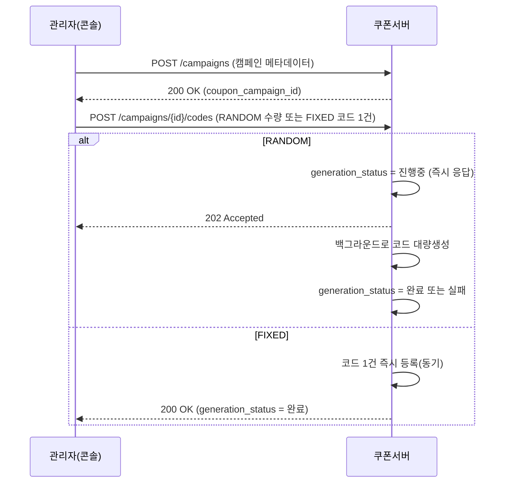
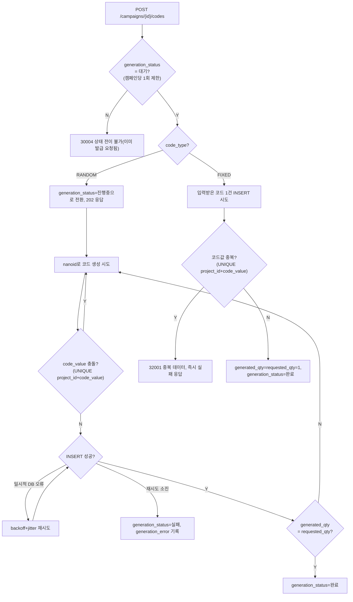

# 05_COUPON_ISSUANCE_SCENARIO.md

## 개요

본 문서는 관리자가 쿠폰 캠페인을 만들고 실제 쿠폰 코드를 발급하는 흐름(캠페인 생성 → 코드 발급 → 생성 실패 시 재시도)을 정리한다. API 엔드포인트/result 코드 등 상세 스펙이 아니라 **흐름 자체의 설계 근거**를 다룬다 — 상세 API 스펙은 [17_CAMPAIGN_API.md](./17_CAMPAIGN_API.md)에서 정리한다.

관련 테이블: `database/tables/coupon_campaign.sql`, `coupon_code.sql`

---

# 1. 왜 캠페인 생성과 코드 발급을 나누는가

캠페인 메타데이터(이름/기간/수량/보상 등록)와 실제 쿠폰 코드 생성은 하나의 API 호출로 묶지 않고 **별도 API로 분리**한다.

```text
POST /campaigns              캠페인 메타데이터만 생성
POST /campaigns/{id}/codes   코드 발급(RANDOM 대량생성 또는 FIXED 단일 코드 등록)
```

RANDOM 대량생성은 수천~수만 건을 만들 수 있어 시간이 걸리고 실패 가능성도 있다. 캠페인 생성 요청 안에 이 처리까지 묶으면 캠페인 생성 자체가 타임아웃/부분실패 위험을 떠안게 된다. 분리하면 캠페인은 항상 즉시·단순하게 생성되고, 코드 발급은 독립적으로 재시도·모니터링할 수 있다. `coupon_campaign.requested_qty`(목표)/`generated_qty`(실제) 컬럼이 이미 "코드 발급 전 캠페인"이라는 상태를 표현할 수 있게 설계돼 있었다는 점도 이 분리와 자연스럽게 맞는다.

캠페인 승인 워크플로우(`approval_status`)는 코드 발급과 독립적으로 동작한다 — 승인 여부와 무관하게 코드는 미리 만들어 둘 수 있으며, `coupon_campaign.status`가 활성(2)으로 전환되는 시점에만 승인 여부(`approval_status IN (1,3)`)를 체크한다(자세한 내용은 `coupon_campaign.sql` 헤더 주석, `04_DATABASE_SCHEMA.md` 참고).

---

# 2. 기본 흐름

`code_type`에 따라 코드 발급 처리 방식이 근본적으로 다르다.

```text
RANDOM : 대량생성 → 비동기 처리 (generation_status: 대기 → 진행중 → 완료/실패)
FIXED  : 관리자가 코드 1건을 직접 입력 → 동기 처리 (즉시 완료). 여러 사용자가 같은 코드를 공유하므로(캠페인당 코드 1건) 목록 등록 개념 자체가 없다
```

**왜 FIXED는 캠페인당 코드 1건뿐인가**: FIXED 코드는 여러 사용자가 같은 코드를 공유한다. 총 사용 가능 수량은 이미 캠페인 레벨의 `usable_qty`/`used_qty`가, 동일 유저 재사용 한도는 `use_limit_per_user`가 각각 제어하므로, 코드 문자열 자체를 여러 개 두어야 할 이유가 없다(채널별로 다른 코드를 배포하고 싶다면 캠페인을 나누면 된다). 그래서 FIXED는 코드 목록 등록이 아니라 단일 코드 등록으로 설계한다. `requested_qty`도 FIXED에서는 "코드 개수"가 아니라 시스템이 항상 `1`로 고정해서, RANDOM과 동일한 "`generated_qty`==`requested_qty` → 완료" 판정 로직을 재사용하기 위한 용도일 뿐이다.

캠페인당 코드 발급 요청(job)은 **1회만 허용**한다(추가 발급/top-up 불가) — job과 campaign이 항상 1:1 관계이므로, 별도 진행상태 추적 테이블 없이 `coupon_campaign.generation_status`/`generation_error` 컬럼만으로 표현 가능하다.



## 2.1 처리 로직 분기



## 2.2 안정성 — 코드 생성 실패 처리

RANDOM 대량생성 전용이다. FIXED는 코드 1건을 동기로 즉시 INSERT 시도하는 것뿐이라 아래 backoff 재시도/`generation_status=4`(실패) 전이 대상이 아니다 — 실패(코드값 중복)하면 `generation_status`를 `1`(대기)로 그대로 둔 채 즉시 오류 응답하고, 관리자가 다른 값으로 [17_CAMPAIGN_API.md](./17_CAMPAIGN_API.md) 3.1을 다시 호출하면 된다.

| 실패 유형 | 원인 | 처리 |
|-----------|------|------|
| 코드값 충돌 | nanoid로 생성한 랜덤값이 같은 프로젝트 내 기존 코드와 우연히 겹침(`UNIQUE(project_id, code_value)`) | 지연 없이 즉시 새 랜덤값으로 재생성(전용 루프, backoff 불필요 — 외부 자원 경합이 아니라 단순 값 재추첨이므로) |
| DB 일시 오류 | 대량 INSERT 도중 deadlock, lock wait timeout 등 | exponential backoff + jitter 재시도(재시도 가능 에러만 대상, 4xx류 등은 즉시 실패 처리) |
| 재시도 소진 | 위 재시도를 다 소진해도 복구 안 됨(예: DB 커넥션 자체 단절) | `generation_status=4(실패)`로 전이, `generation_error`에 최종 실패 사유 기록. 개별 재시도 시도 자체는 DB에 남기지 않고 애플리케이션 로그로만 남김 |

이 재시도는 CLAUDE.md의 "로그 실패는 메인 트랜잭션을 막지 않는다"는 원칙과는 성격이 다르다 — 로그는 "실패해도 무시"가 목적이지만, 코드 생성 재시도는 코드 발급 자체가 메인 작업이므로 "일시 실패 시 재시도해서 성공률을 높이는" 것이 목적이다.

**응답 유실(lost ack)에도 `generated_qty`가 `requested_qty`를 넘지 않는 이유**: 코드 INSERT + COMMIT까지는 DB에서 성공했는데 그 응답이 앱에 전달되지 못하면(커넥션 순간 단절 등), 앱의 로컬 진행 카운터가 실제 DB 값보다 뒤처진 채로 코드 생성을 한 번 더 시도할 수 있다. `SP_CAMPAIGN_CODE_GENERATE_ONE`은 실제로 코드를 INSERT하기 전에 "`generated_qty = generated_qty + 1 WHERE generated_qty < requested_qty AND generation_status = 2 AND status <> 4`" 조건부 UPDATE로 슬롯을 먼저 예약한다(02_DEV_CONVENTIONS.md 4장 "조건부 갱신 우선") — 이미 목표에 도달했으면 이 예약 자체가 실패해 코드를 아예 만들지 않고 현재 값만 그대로 반환한다. 코드값 충돌(1062)이 나면 방금 예약한 슬롯까지 같은 트랜잭션 ROLLBACK 한 번으로 함께 되돌린다. 이 순서(예약 → 생성) 덕분에 이 SP는 몇 번을 더 호출해도 안전한, 사실상 멱등한 "생성 1건, 단 상한 이내" 동작이 되어 앱(`campaign.service.ts`)의 재시도 루프 코드는 전혀 손댈 필요가 없다.

## 2.3 수동 재시도

재시도가 모두 소진되어 `generation_status=4(실패)`가 된 경우, 관리자가 재시도를 트리거할 수 있다.

```text
POST /campaigns/{id}/codes/retry
```

- `generation_status=4(실패)` 상태에서만 허용(조건부 UPDATE로 원자성 확보):
  ```sql
  UPDATE coupon_campaign SET generation_status=2
  WHERE coupon_campaign_id=? AND generation_status=4
  ```
- 이미 생성된 코드(`generated_qty`만큼)는 그대로 두고, 남은 수량(`requested_qty - generated_qty`)만 이어서 생성한다 — 이미 생성된 코드는 `UNIQUE` 제약으로 보호되는 정상 데이터라 버리고 처음부터 다시 만들 이유가 없다.

## 2.4 진행중(`generation_status=2`) 정체 시 수동 복구

RANDOM 대량생성은 서버(NestJS) 프로세스 안의 인메모리 백그라운드 작업(fire-and-forget)으로 돈다 — DB에 별도 job 큐를 두지 않는다(1장 참고). 그래서 이 작업이 도는 도중 서버 프로세스가 재시작되거나 크래시되면, 그 작업은 완전히 유실되지만 `coupon_campaign.generation_status`는 그 순간의 값(`2`, 진행중)에 그대로 멈춰 남는다. `POST /campaigns/{id}/codes`는 `generation_status=1`일 때만, `POST /campaigns/{id}/codes/retry`는 `generation_status=4`일 때만 허용하므로, 이 상태에 빠진 캠페인은 정상 API로는 손댈 수 없다.

```text
POST /campaigns/{id}/codes/abort
```

- 관리자(SUPER_ADMIN/DEVELOPER/MANAGER, OPERATOR 제외)가 "이 job은 멈췄다"고 판단해 수동으로 정체를 풀 수 있다. 단 호출한다고 무조건 되는 게 아니다 — `coupon_campaign.updated_at`(코드를 하나 만들 때마다 자동 갱신됨, `coupon_campaign.sql` 참고)이 임계값(초) 이상 안 움직였을 때만 허용한다(조건부 UPDATE로 원자성 확보):
  ```sql
  UPDATE coupon_campaign SET generation_status=4, generation_error='...'
  WHERE coupon_campaign_id=? AND generation_status=2 AND status<>4
    AND updated_at <= NOW() - INTERVAL :stale_seconds SECOND
  ```
- 이 임계값은 별도 env로 독립시키지 않고, 이미 있는 `CODE_GENERATION_MAX_DB_RETRIES`/`CODE_GENERATION_RETRY_BASE_DELAY_MS`에서 계산한다 — 정상적으로 살아있는 루프가 DB 일시 오류로 재시도할 때 만들 수 있는 이론상 최대 무진행 구간(backoff 누적합 `baseDelay × (2^retries − 1)`)보다 충분히 크게(`CODE_GENERATION_ABORT_STALE_SAFETY_MULTIPLIER`배, 기본 3배) 잡는다. 재시도 설정이 바뀌면 이 임계값도 자동으로 같이 늘어나므로, 두 설정이 서로 어긋날 위험이 없다.
- **RANDOM**은 `generation_status=4`(실패)로 보내 기존 수동 재시도(위 2.3) 흐름을 그대로 재사용한다 — 이미 만든 `generated_qty`부터 이어서 생성됨.
- **FIXED**는 `generation_status=1`(대기)로 되돌린다 — FIXED는 all-or-nothing 동기 처리라 "부분 진행" 개념이 없어 재시도가 아니라 처음부터 재발급하면 된다.
- 되돌리기 전용이라 `edit_count`/`log_coupon_campaign` 둘 다 대상이 아니다(코드 발급은 그 두 축과 독립).
- 살아있는 job이 실수로 abort된 경우까지 대비해, `SP_CAMPAIGN_CODE_GENERATE_ONE`의 슬롯 예약 조건부 UPDATE에도 `generation_status=2`를 함께 걸어둔다 — abort로 상태가 바뀐 뒤에는 그 뒤로 좀비 상태로 남아있을 루프가 코드를 더 만들 수 없고, 자신의 job이 빼앗겼음을 감지해 스스로 멈춘다(2.2의 상한 가드와 같은 방식).

## 2.5 캠페인 종료(`status=4`)가 진행 중인 생성 루프를 멈추지 못하는 문제

`coupon_campaign.status`(라이프사이클)와 `generation_status`(코드 생성 진행상태)는 완전히 별개 축이다(1장 참고) — `POST /campaigns/{id}/status`(종료 처리)는 `generation_status`를 전혀 보지 않고, `SP_CAMPAIGN_CODE_GENERATE_ONE`도 원래 `status`를 안 봤다. 그래서 RANDOM 대량생성이 한창 진행 중(`generation_status=2`)인 캠페인을 관리자가 종료(`status→4`)시켜도, 이미 떠 있는 백그라운드 루프는 그걸 모르고 계속 코드를 만들어 `generation_status=3`(완료)까지 가버릴 수 있었다 — `17_CAMPAIGN_API.md` 1.3(종료된 캠페인 쓰기 차단)이 신규 API 호출은 막지만 이미 실행 중인 백그라운드 job은 막지 못하는 구조적 공백이었다.

- `SP_CAMPAIGN_CODE_GENERATE_ONE`의 슬롯 예약 조건부 UPDATE에 `status<>4`도 함께 건다:
  ```sql
  UPDATE coupon_campaign SET generated_qty=generated_qty+1
  WHERE coupon_campaign_id=? AND generated_qty<requested_qty
    AND generation_status=2 AND status<>4
  ```
- `SP_CAMPAIGN_CHANGE_STATUS`(종료 처리)와 이 SP 둘 다 같은 행에 대한 조건부 UPDATE라, MySQL의 행 단위 락이 둘 사이의 순서를 직렬화해준다 — 종료 처리가 먼저 커밋되면 그 다음 코드 생성 시도는 곧바로 실패한다. 타이밍에 의존하는 레이스 윈도우가 없다.
- 종료는 `generation_status`를 건드리지 않으므로, "이미 목표 도달"(정상)/"job을 빼앗김(abort)"/"캠페인 종료"를 앱이 구분하려면 SP가 no-op 응답에 `status`도 함께 반환해야 한다. TS 백그라운드 루프는 `generation_status<>2 OR status=4`면 조용히 멈추고 `SP_CAMPAIGN_CODE_GENERATION_COMPLETE`/`FAIL`을 호출하지 않는다.
- 종료된 캠페인의 `generation_status`는 억지로 전이시키지 않는다 — `17_CAMPAIGN_API.md` 1.3이 종료된 캠페인의 모든 쓰기 API를 이미 차단하므로, 어떤 값이든 더 손댈 필요가 없는 무해한 상태로 남는다.

---

# 3. 관련 문서

- 테이블 DDL: `database/tables/coupon_campaign.sql`, `coupon_code.sql`
- 재시도 알고리즘 참고: exponential backoff + jitter, 재시도 가능 에러 판별, 재시도 소진 시 예외 처리 패턴
- 쿠폰 사용(reserve/confirm) 흐름: [06_COUPON_USAGE_SCENARIO.md](./06_COUPON_USAGE_SCENARIO.md)
- S2S 인증 정책: [07_AUTH_SECURITY.md](./07_AUTH_SECURITY.md)

상세 요청/응답 스키마, result 코드, FIXED 코드 검증 규칙, 캠페인 승인/반려 API 스펙은 [17_CAMPAIGN_API.md](./17_CAMPAIGN_API.md)에서 확정했다.
