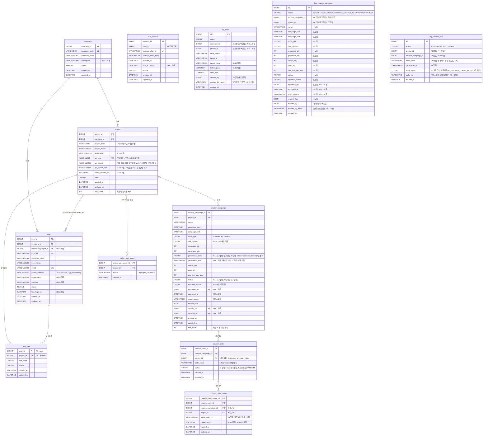

# 05_ERD.md

## Coupon Platform Entity Relationship Diagram

---

---

## FK 미적용 항목

| 테이블 | 컬럼 | 이유 |
|--------|------|------|
| `user_session` | `user_id` | MySQL → Redis 저장소 전환 시 인증 로직 수정 없이 확장 가능하도록 설계(2026-08-05: 저장소 이관이 아니라 `SessionCacheService` 읽기 캐시로 실제 구현 — `09_AUTH_SECURITY.md` 1.3.1) |
| `log_audit` | 전체 (`company_id`/`project_id`/`created_by` 포함) | Append-Only 로그 테이블 원칙 — FK 없음. 실 운영 환경에서 메인 서비스 DB와 별도인 VM/DB에 둔다는 확정 전제([04_DEV_CONVENTIONS.md](./04_DEV_CONVENTIONS.md) 1장 참고) |
| `log_coupon_campaign` | 전체 (`coupon_campaign_id`/`project_id`/`created_by` 포함) | 위와 동일한 로그 원칙 — 원본 스냅샷이라 원본 삭제/변경과 무관하게 값 보존 필요 |
| `log_coupon_use` | 전체 (`project_id`/`coupon_campaign_id`/`created_by` 포함) | 위와 동일. `code_value`도 FK 아님 — 존재하지 않는 코드로 시도한 요청도 그대로 기록해야 하므로 |

## 비정규화 FK 컬럼

로그 테이블과 달리 아래는 실제 FK 제약이 걸려 있지만, 상위 엔티티를 거치지 않고 바로 조회/스코핑하기 위해 의도적으로 중복 저장한 컬럼이다.

| 테이블 | 컬럼 | 원본 경로 | 목적 |
|--------|------|-----------|------|
| `coupon_code` | `project_id` | `coupon_campaign.project_id` | `code_value` 유니크 범위를 프로젝트 단위로 스코핑, reserve 조회 시 프로젝트 소속 검증 |
| `coupon_code_usage` | `coupon_campaign_id` | `coupon_code.coupon_campaign_id` | 사용한도 카운트/미컨슘 조회 |
| `coupon_code_usage` | `project_id` | `coupon_code.project_id` | 미컨슘 조회 API의 크로스테넌트 스코핑 (`game_user_id` 값이 프로젝트 간 우연히 겹칠 수 있어 필요) |

---

## 상태 코드 요약

| 테이블 | 컬럼 | 값 |
|--------|------|----|
| company, project, user_role, user_session | status | 1:사용 / 0:중지 (user_session은 0:로그아웃) |
| user | status | 0:가입승인대기 / 1:가입승인 / 2:가입반려 / 3:사용중지 |
| user_session | status | 1:사용 / 0:로그아웃 / 2:만료 |
| user_role | role_code | 10:SUPER_ADMIN / 20:DEVELOPER / 30:MANAGER / 40:OPERATOR |
| log_audit | action | 10:CREATE / 20:UPDATE / 30:STATUS_CHANGE |
| coupon_campaign | code_type | 1:RANDOM / 2:FIXED |
| coupon_campaign | status | 1:대기 / 2:활성 / 3:일시중지 / 4:종료 |
| coupon_campaign | approval_status | 1:승인불요 / 2:승인대기 / 3:승인완료 / 4:반려 (status와 별개 축) |
| coupon_campaign | generation_status | 1:대기 / 2:진행중 / 3:완료 / 4:실패 (status/approval_status와 별개 축) |
| coupon_code | status | 0:중지 / 1:미사용(RANDOM)·사용중(FIXED) / 2:사용완료(RANDOM 전용) |
| log_coupon_campaign | action | 10:CREATE / 20:UPDATE / 30:STATUS_CHANGE / 40:APPROVE / 50:REJECT |
| log_coupon_use | action | 10:RESERVE / 20:CONFIRM |
| log_coupon_use | result_type | 0:성공 / 10:코드없음 / 20:이미소모·중지 / 30:캠페인 사용불가 / 40:사용자한도초과 / 50:소모기록없음(CONFIRM 전용) — API result 코드 매핑은 [20_COUPON_USAGE_API.md](./20_COUPON_USAGE_API.md) 4장 참고 |
