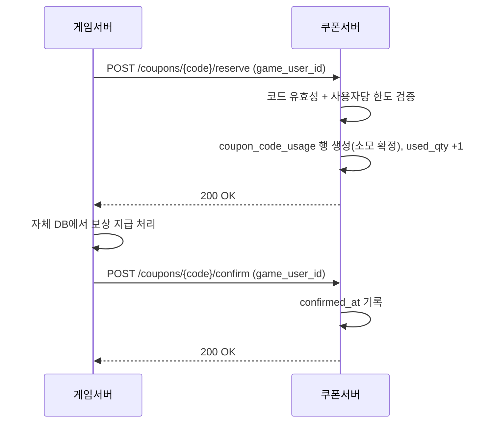
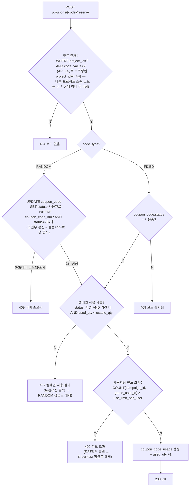
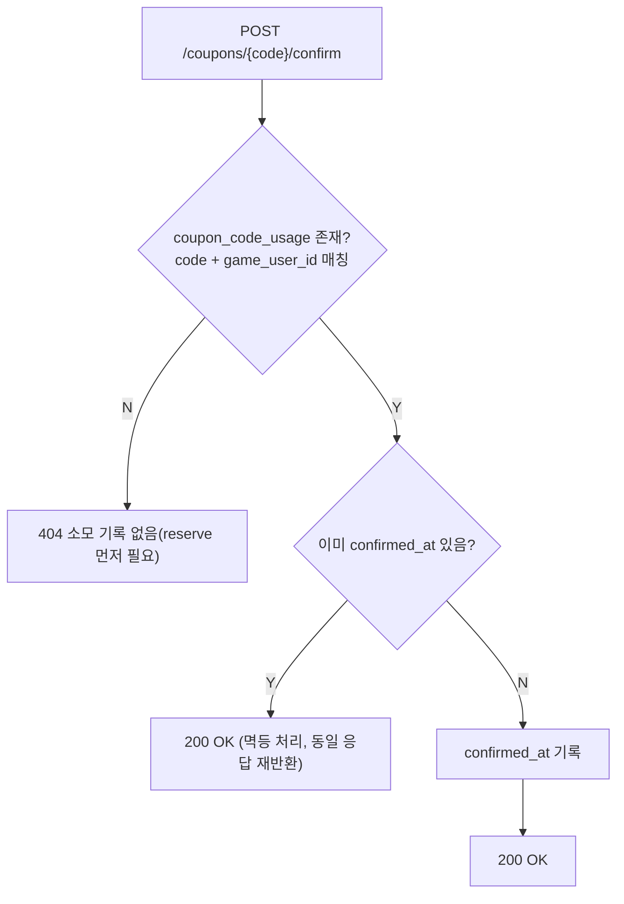

# 14_COUPON_USAGE_SCENARIO.md

## 개요

본 문서는 게임서버가 쿠폰 코드를 검증·소모하는 전체 흐름(reserve → confirm)과 지급 실패 시 재시도 처리 방식을 정리한다. API 엔드포인트/result 코드 등 상세 스펙이 아니라 **흐름 자체의 설계 근거**를 다룬다 — 상세 API 스펙은 별도 문서(TODO)로 정리한다.

관련 테이블: `database/tables/coupon_campaign.sql`, `coupon_code.sql`, `coupon_code_usage.sql`

---

# 1. 왜 reserve/confirm을 나누는가

쿠폰 사용은 "검증"과 "보상 지급"이 서로 다른 서비스의 DB에서 일어난다.

```text
검증(코드 유효성/사용자당 한도)  : Coupon Platform DB
보상 지급(아이템 등 실제 지급)   : 게임서버 DB (Coupon Platform은 관여하지 않음)
```

같은 서비스 내부라면 단일 트랜잭션으로 묶어 완결시킬 수 있지만, 물리적으로 분리된 두 서비스·두 DB 사이에서는 트랜잭션을 묶을 수 없다(분산 트랜잭션 문제). 그래서 검증과 지급 완료 기록을 분리해 **reserve(검증+소모 확정) → confirm(지급 결과 기록)** 두 단계로 나눈다.

## 1.1 소모 확정 시점 — reserve 즉시 확정 모델

reserve와 confirm을 나누는 것과, "언제 쿠폰이 최종 소모된 것으로 볼지"는 별개의 결정이다. 본 설계는 **reserve 성공 = 즉시 최종 소모 확정**을 택했다(예약 상태로 잠깐 대기했다가 confirm으로 넘어가는 중간 단계 없음). IAP(인앱결제)의 consume/acknowledge 패턴과 동일한 구조다.

```text
reserve 성공  → coupon_code_usage 행 생성 = 이 시점에 이미 최종 소모 확정
              → coupon_campaign.used_qty 원자적 +1
              → RANDOM은 coupon_code.status 도 함께 사용완료로 전환
confirm       → 상태를 바꾸지 않는다. confirmed_at 에 지급 성공 시각만 기록(결과 보고일 뿐)
```

confirm이 끝내 오지 않아도 쿠폰서버는 **아무것도 자동으로 되돌리지 않는다.** 대신 confirm이 안 된 건을 게임서버가 스스로 찾아 재처리할 수 있도록 조회 API(3장)를 제공한다 — 재시도 여부·시점 판단은 전적으로 게임서버 책임이며, 쿠폰서버가 게임서버로 먼저 호출을 거는 콜백/웹훅은 없다.

이 모델을 택한 이유: 대안(예약중 상태 + 만료 배치로 자동 되돌림)은 이중지급 가능 race window와 배치 인프라가 필요했던 반면, 즉시 확정 모델은 이중지급 가능성 자체가 없다(코드가 한 번 소모되면 재예약 여지가 없으므로). 대신 게임서버 지급이 영영 실패하면 그 쿠폰은 소모된 채로 남고 자동 복구가 없다는 트레이드오프가 있다 — 이건 3장의 미컨슘 조회 API로 게임서버가 직접 감지·처리하게 한다.

## 1.2 코드 식별 범위 — 프로젝트 단위 스코핑

`{code}` 경로 파라미터(`code_value`)의 유효 범위는 전체 플랫폼이 아니라 **프로젝트 단위**다. `coupon_code`는 `project_id`를 비정규화해서 갖고(`coupon_campaign`을 통해서도 알 수 있지만, 유니크 제약과 조회 스코핑을 위해 직접 보유), `UNIQUE KEY(project_id, code_value)`로 프로젝트 범위 안에서만 유일하면 되도록 한다.

```text
RANDOM: code_value = nanoid 생성값 그대로 (예: XXXX-XXXX-XXXX)
FIXED : code_value = 관리자 입력값 그대로
```

FIXED는 관리자가 자유 문자열을 입력하므로(`use_hyphen`과 같은 원칙 — 시스템이 값을 가공하지 않음), `code_value`를 플랫폼 전체 유니크로 두면 서로 다른 회사가 같은 문구(예: "SUMMER2024")를 쓰려 할 때 충돌한다. 유니크 범위를 프로젝트 단위로 좁혀 이 충돌을 없앤다(프로젝트별 코드 접두어 같은 별도 장치는 두지 않음 — 유니크 제약만으로 충돌 방지에 충분해 불필요한 것으로 판단해 제외). 부수 효과로 reserve 조회(`WHERE project_id=? AND code_value=?`, project_id는 API Key로 스코핑)가 자연스럽게 "이 코드가 요청한 프로젝트 소속인지"까지 함께 검증하게 된다.

---

# 2. 기본 흐름



`coupon_code_usage`(소모 기록)는 RANDOM/FIXED 공통이지만, `coupon_code.status`는 RANDOM에서만 의미를 갖는다(4장 참고 — FIXED는 코드 하나를 여러 유저가 공유하므로 개별 소모를 코드 상태로 표현할 수 없음).

| 단계 | 주체 | `coupon_code_usage` (공통) | `coupon_code.status` — RANDOM | `coupon_code.status` — FIXED |
|------|------|------------------------------|-------------------------------|-------------------------------|
| reserve | 게임서버 → 쿠폰서버 | 행 생성(`confirmed_at=NULL`) | 1(미사용) → 2(사용완료) | 변화 없음 (1:사용중 유지) |
| 보상 지급 | 게임서버 (내부 처리) | 없음 — 쿠폰서버는 관여/인지하지 않음 | 없음 | 없음 |
| confirm | 게임서버 → 쿠폰서버 | `confirmed_at` 기록 | 변화 없음(이미 reserve에서 확정) | 변화 없음 |

## 2.1 reserve/confirm 처리 로직 분기

시퀀스 다이어그램의 "코드 유효성 + 사용자당 한도 검증" 한 단계를 실제 판단 분기로 풀어보면 다음과 같다. 코드 잠금 방식이 RANDOM/FIXED에서 근본적으로 다르므로(4장 참고) 코드 존재 확인 직후 `code_type`으로 먼저 갈라진다. 아래 전체 과정은 하나의 SP 트랜잭션으로 처리되므로, 잠금 이후 단계(캠페인/한도 체크)에서 실패하면 앞서 건 코드 잠금(RANDOM의 조건부 UPDATE)도 트랜잭션 롤백으로 자동 해제된다 — 별도 롤백 로직 불필요.





## 2.2 동시성 고려사항

2.1의 흐름도는 판단 로직을 보여주기 위한 것이고, 실제 SP 구현에서 각 분기가 동시 요청에도 안전하려면 아래와 같이 처리해야 한다. 공통 원칙: **체크 후 쓰기(check-then-act)를 분리하지 않고, 조건이 포함된 단일 UPDATE/락으로 원자성을 확보한다.**

| 대상 | 문제 상황 | 해결 방식 |
|------|-----------|-----------|
| RANDOM 코드 소모 | 같은 코드에 동시 reserve 시 이중 소모 가능 | `UPDATE coupon_code SET status=사용완료 WHERE coupon_code_id=? AND status=미사용` 조건부 갱신 (영향 행 0건이면 실패). `coupon_code_id`는 앞서 `WHERE project_id=? AND code_value=?`(uk_project_code_value 활용)로 조회해 확보 — 다른 프로젝트 소속 코드는 이 조회 단계에서부터 걸러짐 |
| 캠페인 사용 가능 여부(`usable_qty`/`status`/기간) | 서로 다른 코드로 동시 reserve 시 `used_qty`가 `usable_qty`를 초과(오버셀)하거나, 관리자가 캠페인을 일시중지/종료시키는 순간과 겹쳐 그 이후에도 reserve가 통과할 수 있음 | `UPDATE coupon_campaign SET used_qty=used_qty+1 WHERE used_qty<usable_qty AND status=2 AND NOW() BETWEEN campaign_start AND campaign_end` 조건부 갱신 하나로 세 조건을 전부 원자적으로 체크 — 캠페인 상태/기간 조건도 같은 UPDATE의 WHERE에 포함시키는 것만으로 추가 비용 없이 관리자의 일시중지/종료 레이스까지 같이 막힘(FIXED 코드 중지처럼 별도 락 비용이 드는 게 아니라 공짜로 닫히는 케이스). (`-1` 대입으로 UNSIGNED 오류를 유도하는 방식은 `sql_mode`가 non-strict로 바뀌면 에러 없이 0으로 조용히 clamp되는 위험이 있어 채택하지 않음) |
| 사용자당 한도(`use_limit_per_user`) | 같은 유저가 서로 다른 코드로 동시 reserve 시 `COUNT(*)` 체크를 둘 다 통과해 한도 초과 가능 | `SELECT COUNT(*) FROM coupon_code_usage WHERE coupon_campaign_id=? AND game_user_id=? FOR UPDATE`로 잠금 읽기 — `ix_campaign_user` 인덱스 덕분에 InnoDB가 해당 구간에 갭락을 걸어 동시 INSERT를 직렬화함(단순 INSERT 후 재검증 방식은 서로의 미커밋 행을 못 보므로 막아지지 않아 기각) |
| confirm 중복 호출 | 게임서버가 confirm을 재시도로 두 번 보낼 수 있음 | 별도 락 불필요 — `confirmed_at`을 두 번 써도 같은 결과(멱등)라 무해함 |

위 표에서 다루지 않은 것: **FIXED 코드의 관리자 중지와 reserve 사이의 레이스**(관리자가 코드를 중지시키는 순간과 진행 중이던 reserve의 체크~확정 사이 수 ms 틈에 요청이 끼어드는 경우)는 검토했으나 범위 밖으로 판단해 대응하지 않는다 — 관리자 중지 자체가 빈번한 작업이 아니고 겹치는 시간창도 극히 좁아, 이걸 막으려고 FIXED 코드에 락을 거는 비용(정상 상황의 다중 동시 사용 성능 저하)이 더 크다. 캠페인 일시중지/종료와 달리 이건 별도 조건을 끼워 넣을 기존 UPDATE 문 자체가 없어(FIXED는 애초에 락 없는 단순 SELECT 체크) 공짜로 닫을 방법이 없다.

## 2.3 SP 구현 시 유의사항 — 락 획득 순서

reserve 하나가 (RANDOM인 경우) 코드 행 락, 캠페인 행 락, 사용자 한도 갭락까지 최대 3개 자원을 순서대로 잠글 수 있다. 이 순서가 SP마다 또는 호출 경로마다 다르면 두 트랜잭션이 서로 다른 순서로 잠가 교착상태(deadlock)가 날 수 있다. 데이터가 깨지는 문제는 아니고(MySQL이 감지해 한쪽 트랜잭션을 강제 중단시킴) 그 트랜잭션은 실패 응답을 받으므로 게임서버가 재시도하면 되지만, 불필요한 실패를 줄이려면 모든 reserve 경로가 **코드 락 → 캠페인 락 → 사용자 한도 갭락** 순서를 항상 동일하게 지키도록 SP를 구현해야 한다.

---

# 3. confirm이 안 온 경우 — 미컨슘 조회 API

쿠폰서버는 재시도를 대신 해주지 않고, "지급 확인이 안 된 소모 건"을 게임서버가 조회할 수 있게 API만 제공한다. IAP의 `queryPurchasesAsync`(클라이언트가 미처리 구매를 재확인) + 서버측 리컨실리에이션 배치와 같은 역할이다.

## 3.1 특정 유저 미컨슘 조회

```text
GET /coupons/unconfirmed?game_user_id={game_user_id}&campaign_id={campaign_id?}
```

- 용도: 특정 유저 로그인 시점 등에 "이 유저가 놓친 지급이 있는지" 확인
- `game_user_id` 필수, `campaign_id` 선택 필터
- project는 API Key(S2S 인증)로 자동 스코핑

## 3.2 전체 유저 미컨슘 조회

```text
GET /coupons/unconfirmed?campaign_id={campaign_id?}&page={page}&page_size={page_size}
```

- 용도: 게임서버가 주기적으로 훑어 놓친 지급을 일괄 재처리(리컨실리에이션 배치)
- `campaign_id` 선택 필터, 페이지네이션 필수(건수가 많을 수 있음)
- project는 API Key로 자동 스코핑

두 API 모두 실제 쿼리는 `coupon_code_usage.project_id`(비정규화 컬럼) 기준으로 스코핑한다. `game_user_id`는 게임서버가 자체 부여하는 값이라 서로 다른 프로젝트끼리 우연히 같은 값을 쓸 수 있으므로, `campaign_id`를 생략한 3.1 조회에서도 `WHERE project_id=? AND game_user_id=?`로 항상 안전하게 좁혀진다 — `campaign_id`만으로는 필터가 없을 때 스코핑할 방법이 없어 다른 프로젝트의 데이터가 섞여 나올 수 있었다(설계 중 발견해 `coupon_code_usage`에 `project_id`를 추가로 반영함).

## 3.3 공통 응답 필드

게임서버가 실제로 재처리(보상 재지급 + confirm 재시도)할 수 있어야 하므로, 지급에 필요한 정보를 함께 반환한다.

```text
code_value            쿠폰 코드 문자열
game_user_id          게임서버 유저 식별자
coupon_campaign_id    캠페인 ID
reward_data           캠페인의 보상 내용(coupon_campaign.reward_data 조인)
created_at            소모(reserve) 확정 일시
```

조회 조건은 공통으로 `confirmed_at IS NULL`이다.

---

# 4. 동시성 — 같은 코드를 다른 유저가 요청하는 경우

`code_type`에 따라 동작이 다르다.

| 구분 | 잠금 단위 | 동시 예약 | 사용자당 한도 체크 |
|------|-----------|-----------|---------------------|
| RANDOM | `coupon_code.status` (`UPDATE ... WHERE status=미사용` 조건부 갱신이 검증+락+확정을 한 번에 처리) | 불가 — 코드 하나는 단 한 번만 소모 가능 | 코드 자체가 1회용이므로 사실상 무의미 |
| FIXED | 없음 (`coupon_code.status`는 코드 전체 on/off만 의미) | 가능 — 여러 유저가 동시에 각자 소모 | `coupon_code_usage`에서 `game_user_id` 기준 개별 카운트 |

## 4.1 RANDOM 예시 — A가 소모 후 보상 지급 실패, B가 같은 코드 요청

```text
1. A: reserve(AA코드) → 성공, coupon_code.status=사용완료(영구 확정), coupon_code_usage 행 생성(confirmed_at=NULL)
2. A측 보상 지급 실패(confirm 안 옴)
3. B: reserve(AA코드) → 즉시 실패 (coupon_code.status가 이미 사용완료라 조건부 UPDATE 0건)
4. B는 이 코드를 영영 쓸 수 없다(RANDOM은 1회용이므로 정상 동작 — 이중지급 가능성 자체가 없음)
5. A건의 지급 실패는 3장의 미컨슘 조회 API로 게임서버가 감지해 직접 재처리해야 함(쿠폰서버는 관여하지 않음)
```

## 4.2 FIXED 예시 — A가 소모 후 보상 지급 실패, B가 같은 코드 요청

```text
1. A: reserve(FF코드, game_user_id=A) → 성공, coupon_code_usage 행 생성(A용, confirmed_at=NULL)
2. A측 보상 지급 실패(confirm 안 옴)
3. B: reserve(FF코드, game_user_id=B) → A와 무관하게 즉시 성공
   (coupon_code.status는 코드 전체 on/off만 의미, 한도 체크는 game_user_id별로 독립)
```

---

# 5. 관련 문서

- 테이블 DDL: `database/tables/coupon_campaign.sql`, `coupon_code.sql`, `coupon_code_usage.sql`
- S2S 인증(게임서버 → 쿠폰서버) 정책: [04_AUTH_SECURITY.md](./04_AUTH_SECURITY.md) — 요청 서명 방식 등 세부는 본 문서의 흐름 확정 후 후속 작업으로 결정 예정(TODO)
